---
## Front matter
title: "Julia. Установка и настройка. Основные принципы"
subtitle: "Лабораторная работа № 1"
author: "Шулуужук Айраана НПИбд-02-22"

## Generic otions
lang: ru-RU
toc-title: "Содержание"

## Bibliography
bibliography: bib/cite.bib
csl: pandoc/csl/gost-r-7-0-5-2008-numeric.csl

## Pdf output format
toc: true # Table of contents
toc-depth: 2
lof: true # List of figures
lot: true # List of tables
fontsize: 12pt
linestretch: 1.5
papersize: a4
documentclass: scrreprt
## I18n polyglossia
polyglossia-lang:
  name: russian
  options:
	- spelling=modern
	- babelshorthands=true
polyglossia-otherlangs:
  name: english
## I18n babel
babel-lang: russian
babel-otherlangs: english
## Fonts
mainfont: IBM Plex Serif
romanfont: IBM Plex Serif
sansfont: IBM Plex Sans
monofont: IBM Plex Mono
mathfont: STIX Two Math
mainfontoptions: Ligatures=Common,Ligatures=TeX,Scale=0.94
romanfontoptions: Ligatures=Common,Ligatures=TeX,Scale=0.94
sansfontoptions: Ligatures=Common,Ligatures=TeX,Scale=MatchLowercase,Scale=0.94
monofontoptions: Scale=MatchLowercase,Scale=0.94,FakeStretch=0.9
mathfontoptions:
## Biblatex
biblatex: true
biblio-style: "gost-numeric"
biblatexoptions:
  - parentracker=true
  - backend=biber
  - hyperref=auto
  - language=auto
  - autolang=other*
  - citestyle=gost-numeric
## Pandoc-crossref LaTeX customization
figureTitle: "Рис."
tableTitle: "Таблица"
listingTitle: "Листинг"
lofTitle: "Список иллюстраций"
lotTitle: "Список таблиц"
lolTitle: "Листинги"
## Misc options
indent: true
header-includes:
  - \usepackage{indentfirst}
  - \usepackage{float} # keep figures where there are in the text
  - \floatplacement{figure}{H} # keep figures where there are in the text
---

# Цель работы

Основная цель работы — подготовить рабочее пространство и инструментарий для
работы с языком программирования Julia, на простейших примерах познакомиться
с основами синтаксиса Julia.

# Выполнение лабораторной работы

Установим под свою операционную систему Julia, Jupyter (рис. [-@fig:001]) (рис. [-@fig:002])

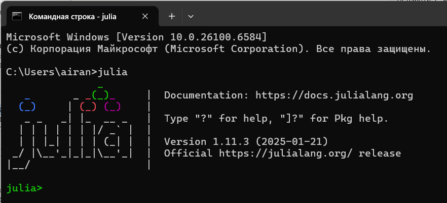{#fig:001 width=70%}

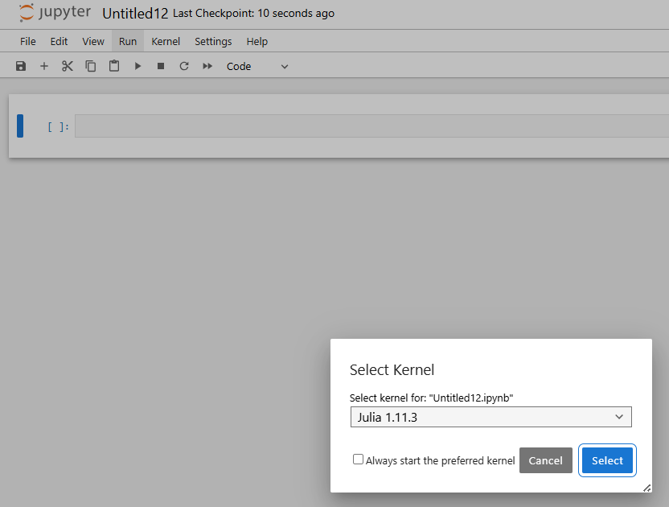{#fig:002 width=70%}

Используя Jupyter Lab, повторим примеры из раздела (рис. [-@fig:003]) (рис. [-@fig:004]) (рис. [-@fig:005])  (рис. [-@fig:006])

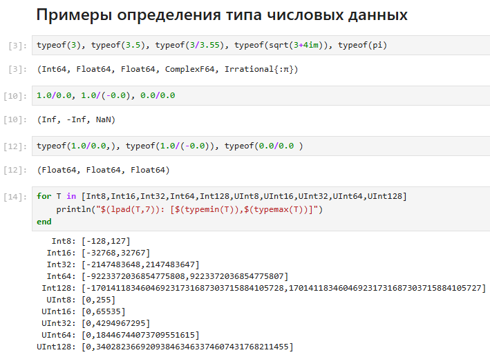{#fig:003 width=70%}

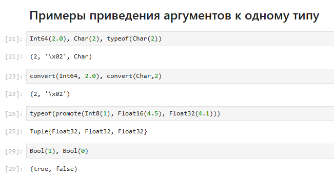{#fig:004 width=70%}

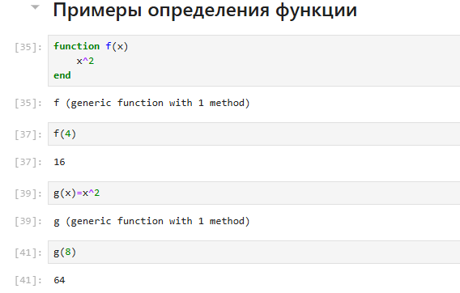{#fig:005 width=70%}

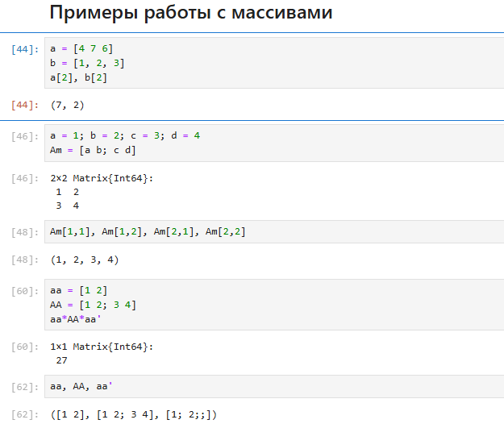{#fig:006 width=70%}

Выполним задания для самостоятельной работы

1. Изучим документацию по основным функциям Julia для чтения / записи / вывода информации на экран: read(), readline(), readlines(), readdlm(), print(), println(), show(), write(). Приведите свои примеры их использования, поясняя особенности их применения.

Функции print() выводит без перехода на новую строку. println(): выводит с переходом на новую строку (рис. [-@fig:007])

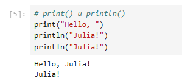{#fig:007 width=70%}

show(): выводит представление объекта, часто более "техническое" (рис. [-@fig:008]).

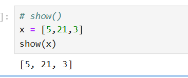{#fig:008 width=70%}

read(): читает байты или символы из файла или стандартного ввода (рис. [-@fig:009]).

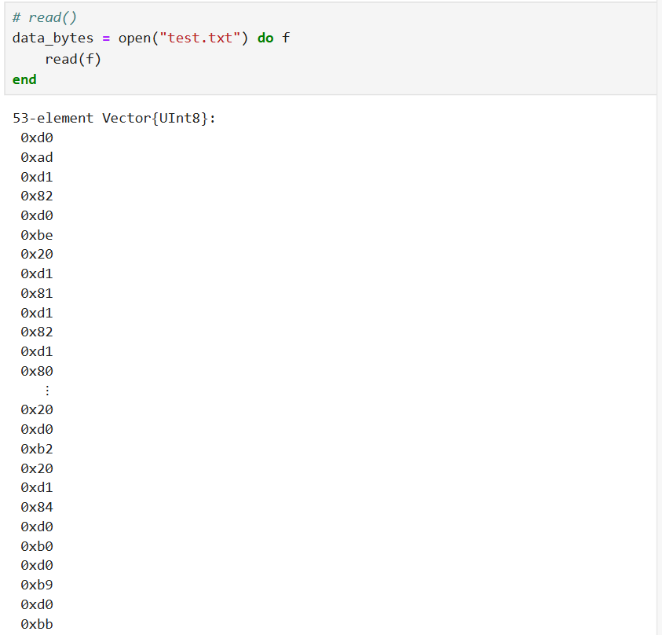{#fig:009 width=70%}

readline(): читает одну строку из файла или стандартного ввода.
readlines(): читает все строки из файла или ввода в массив строк (рис. [-@fig:010]).

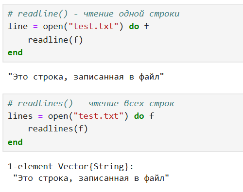{#fig:010 width=70%}

2. Изучим документацию по функции parse(). Приведем свои примеры её использования, поясняя особенности её применения. Используется для преобразования строки в число или другой тип данных (рис. [-@fig:011]).

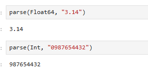{#fig:011 width=70%}

3. Изучим синтаксис Julia для базовых математических операций с разным типом переменных: сложение, вычитание, умножение, деление, возведение в степень, извлечение корня, сравнение, логические операции. Приведите свои примеры с пояснениями по особенностям их применения (рис. [-@fig:012]) (рис. [-@fig:013]).

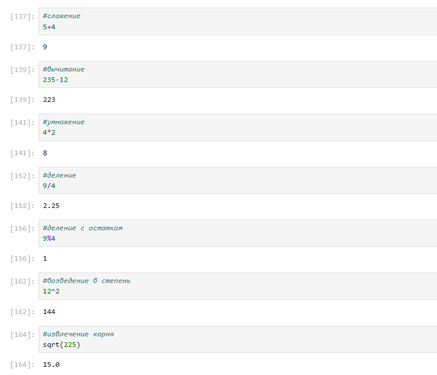{#fig:012 width=70%}

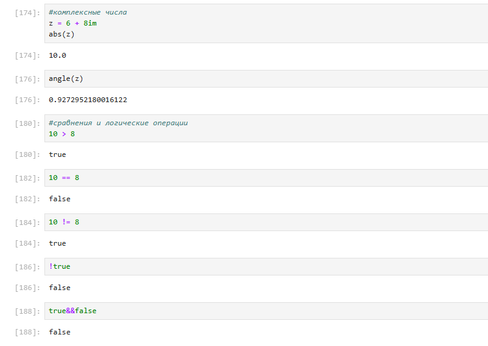{#fig:013 width=70%}

4. Приведите несколько своих примеров с пояснениями с операциями над матрицами
и векторами: сложение, вычитание, скалярное произведение, транспонирование,
умножение на скаляр (рис. [-@fig:014]) (рис. [-@fig:015])

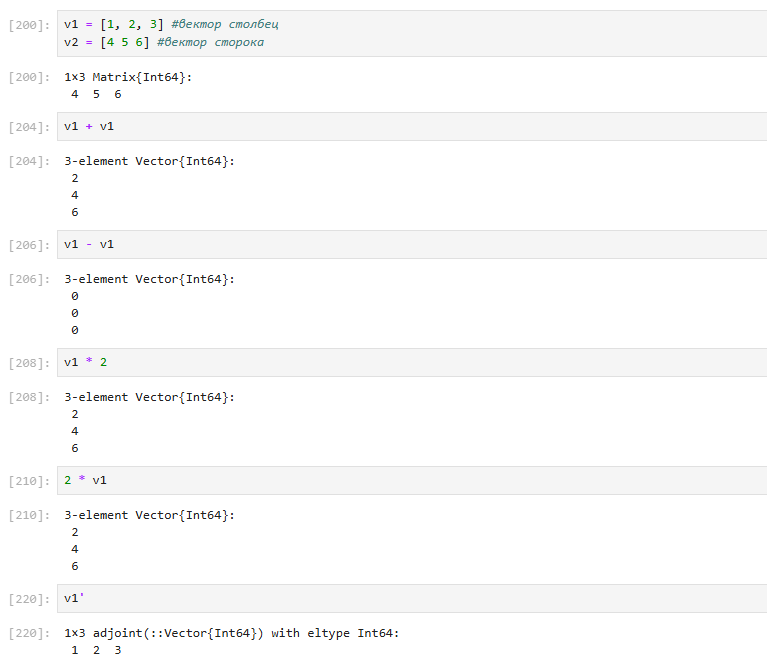{#fig:014 width=70%}

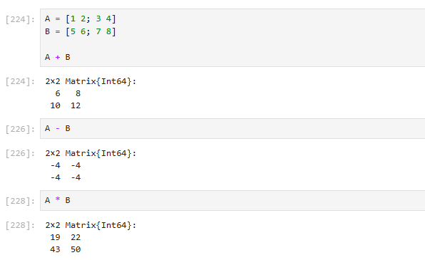{#fig:015 width=70%}

# Выводы

В результате выполнения лабораторной работы подготовили рабочее пространство и инструментарий для
работы с языком программирования Julia, на простейших примерах познакомились с основами синтаксиса Julia.
