---
## Front matter
title: "Управляющие структуры"
subtitle: "Лабораторная работа № 3"
author: "Шулуужук Айраана НПИбд-02-22"

## Generic otions
lang: ru-RU
toc-title: "Содержание"

## Bibliography
bibliography: bib/cite.bib
csl: pandoc/csl/gost-r-7-0-5-2008-numeric.csl

## Pdf output format
toc: true # Table of contents
toc-depth: 2
lof: true # List of figures
lot: true # List of tables
fontsize: 12pt
linestretch: 1.5
papersize: a4
documentclass: scrreprt
## I18n polyglossia
polyglossia-lang:
  name: russian
  options:
	- spelling=modern
	- babelshorthands=true
polyglossia-otherlangs:
  name: english
## I18n babel
babel-lang: russian
babel-otherlangs: english
## Fonts
mainfont: IBM Plex Serif
romanfont: IBM Plex Serif
sansfont: IBM Plex Sans
monofont: IBM Plex Mono
mathfont: STIX Two Math
mainfontoptions: Ligatures=Common,Ligatures=TeX,Scale=0.94
romanfontoptions: Ligatures=Common,Ligatures=TeX,Scale=0.94
sansfontoptions: Ligatures=Common,Ligatures=TeX,Scale=MatchLowercase,Scale=0.94
monofontoptions: Scale=MatchLowercase,Scale=0.94,FakeStretch=0.9
mathfontoptions:
## Biblatex
biblatex: true
biblio-style: "gost-numeric"
biblatexoptions:
  - parentracker=true
  - backend=biber
  - hyperref=auto
  - language=auto
  - autolang=other*
  - citestyle=gost-numeric
## Pandoc-crossref LaTeX customization
figureTitle: "Рис."
tableTitle: "Таблица"
listingTitle: "Листинг"
lofTitle: "Список иллюстраций"
lotTitle: "Список таблиц"
lolTitle: "Листинги"
## Misc options
indent: true
header-includes:
  - \usepackage{indentfirst}
  - \usepackage{float} # keep figures where there are in the text
  - \floatplacement{figure}{H} # keep figures where there are in the text
---

# Цель работы

Основная цель работы — освоить применение циклов функций и сторонних для Julia
пакетов для решения задач линейной алгебры и работы с матрицами.

# Выполнение лабораторной работы

## Циклы for, while 

Для различных операций, связанных с перебором индексируемых элементов структур
данных, традиционно используются циклы while и for (рис. [-@fig:001]) (рис. [-@fig:002])

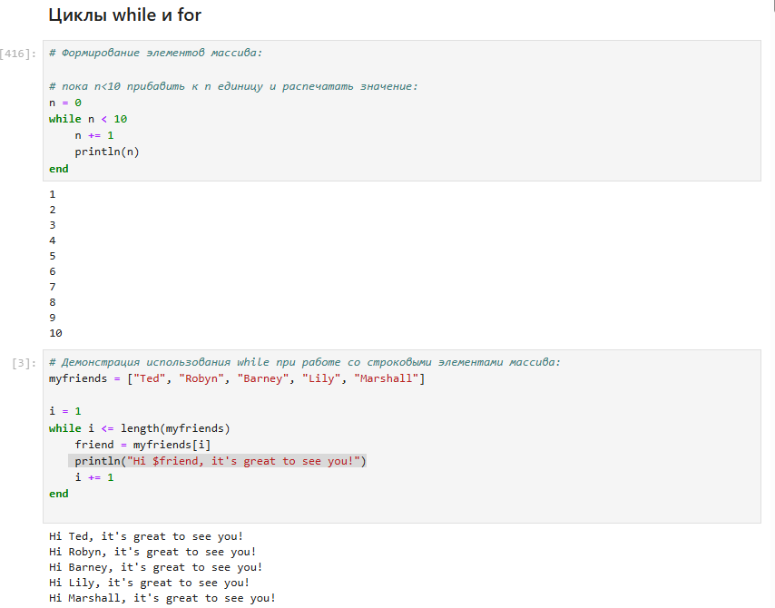{#fig:001 width=70%}

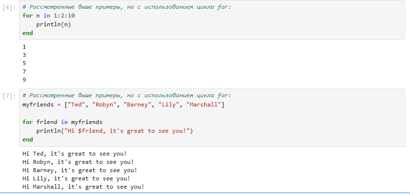{#fig:002 width=70%}

## Условные выражения

Довольно часто при решении задач требуется проверить выполнение тех или иных
условий. Для этого используют условные выражения (рис. [-@fig:003]) 

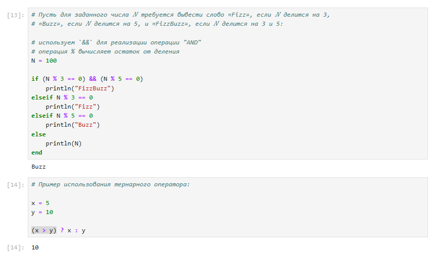{#fig:003 width=70%}

## Функции

Julia дает нам несколько разных способов написать функцию. Первый требует ключевых
слов function и end (рис. [-@fig:004]) (рис. [-@fig:005])  (рис. [-@fig:006])

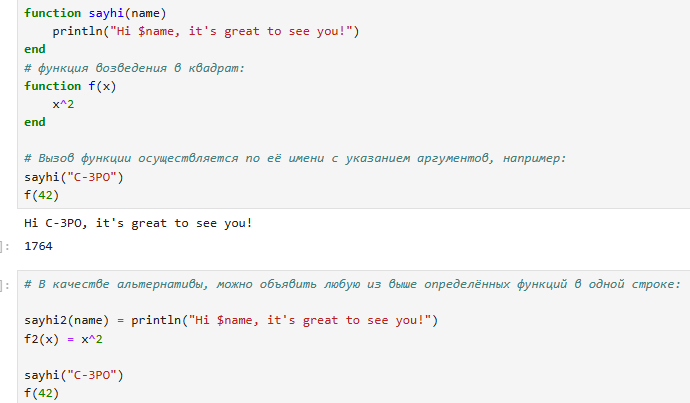{#fig:004 width=70%}

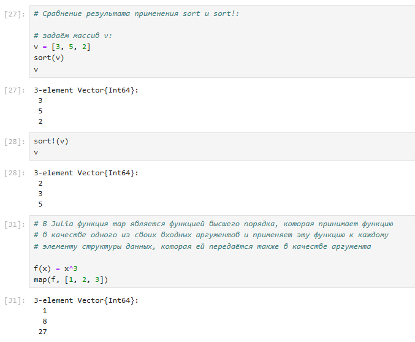{#fig:005 width=70%}

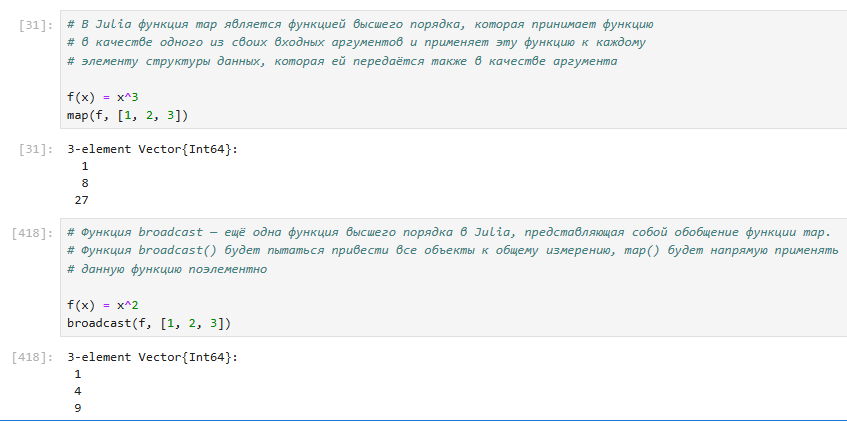{#fig:006 width=70%}

## Сторонние библиотеки (пакеты) в Julia

При первом использовании пакета в вашей текущей установке Julia вам необходимо
использовать менеджер пакетов, чтобы явно его добавить (рис. [-@fig:007])

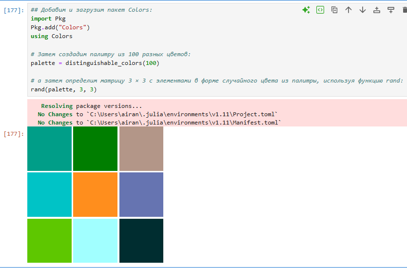{#fig:007 width=70%}

## Выполнение самостоятельной работы

1. Используя циклы while и for:
- выведите на экран целые числа от 1 до 100 и напечатайте их квадраты (рис. [-@fig:008]).

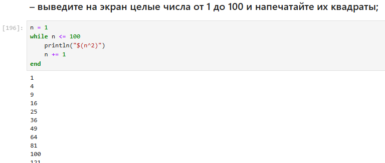{#fig:008 width=70%}

- создайте словарь squares, который будет содержать целые числа в качестве ключей и квадраты в качестве их пар-значений (рис. [-@fig:009]).

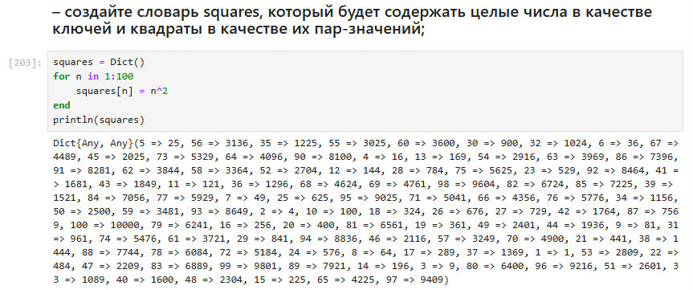{#fig:009 width=70%}

- создайте массив squares_arr, содержащий квадраты всех чисел от 1 до 100. (рис. [-@fig:010]).

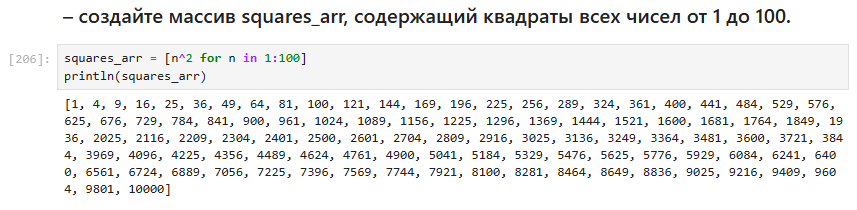{#fig:010 width=70%}

2. Напишите условный оператор, который печатает число, если число чётное, и строку
«нечётное», если число нечётное. Перепишите код, используя тернарный оператор (рис. [-@fig:011]).

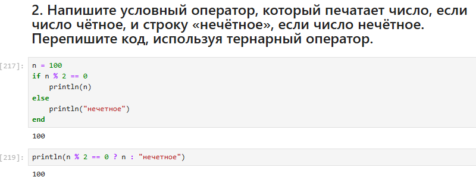{#fig:011 width=70%}

3. Напишите функцию add_one, которая добавляет 1 к своему входу (рис. [-@fig:012]) 

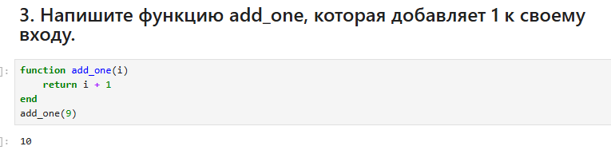{#fig:012 width=70%}

4. Используйте map() или broadcast() для задания матрицы 𝐴, каждый элемент кото-
рой увеличивается на единицу по сравнению с предыдущим (рис. [-@fig:013]).

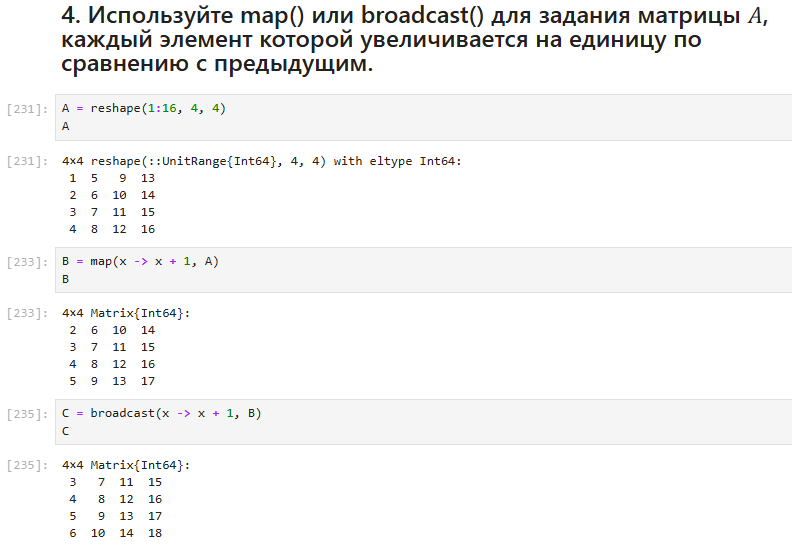{#fig:013 width=70%}

5. Задайте матрицу A следующего вида, найти куб, заменить 3 столбец на сумму 2 и 3 столбцов (рис. [-@fig:014]) 

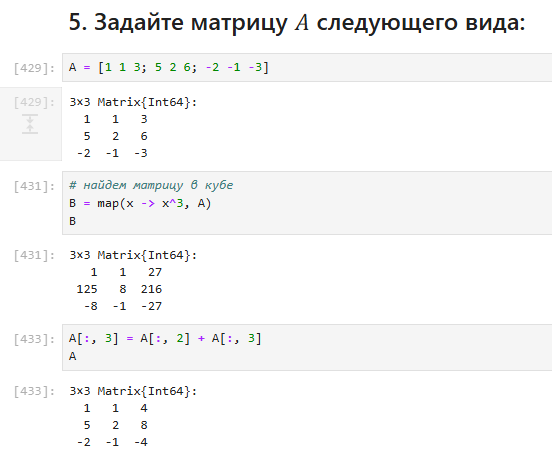{#fig:014 width=70%}

6. Создайте матрицу B с элементами 
Вычислите матрицу C = 𝐵𝑇𝐵 (рис. [-@fig:015])

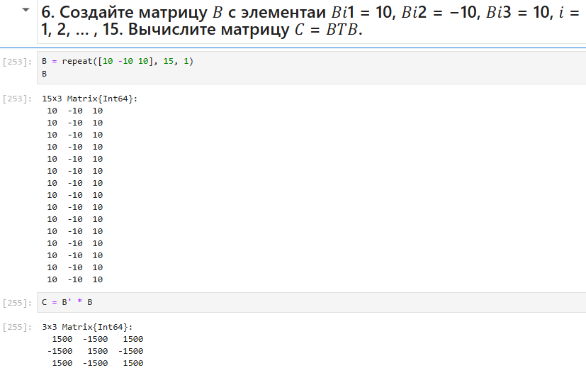{#fig:015 width=70%}

7. Создайте матрицу Z размерности 6 × 6, все элементы которой равны нулю, и матрицу
𝐸, все элементы которой равны 1. Используя цикл while или for и закономерности
расположения элементов, создайте следующие матрицы размерности 6 × 6 (рис. [-@fig:016]) (рис. [-@fig:017])

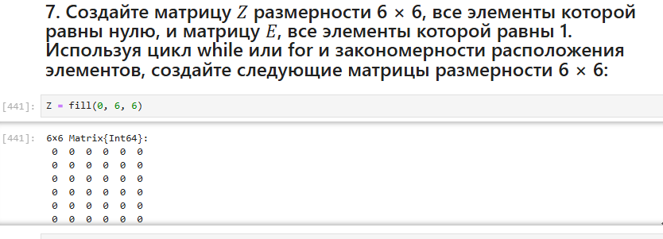{#fig:016 width=70%}

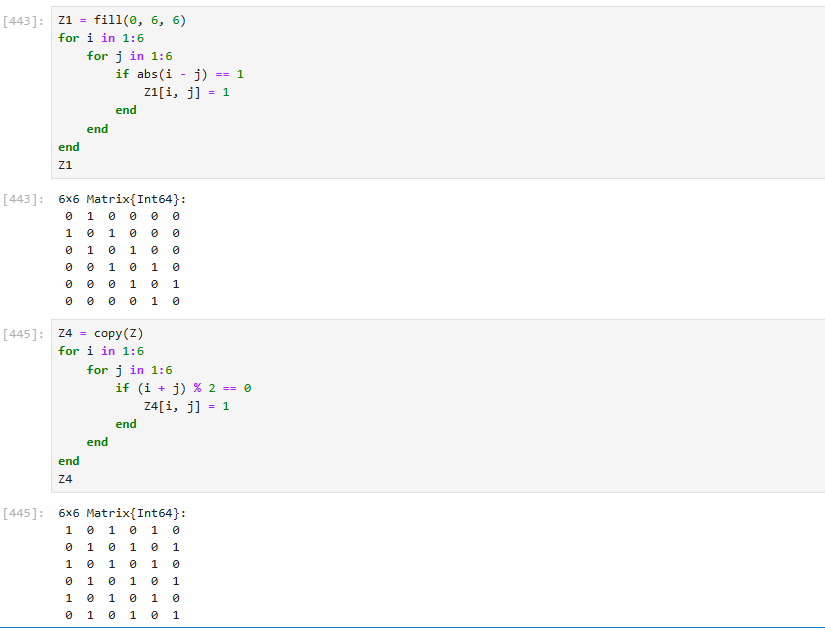{#fig:017 width=70%}

8. В языке R есть функция outer(). Фактически, это матричное умножение с возмож-
ностью изменить применяемую операцию (например, заменить произведение на
сложение или возведение в степень).

- Напишите свою функцию, аналогичную функции outer() языка R. Функция
должна иметь следующий интерфейс: outer(x,y,operation). Таким образом,
функция вида outer(A,B,*) должна быть эквивалентна произведению матриц
A и B размерностями L × M и M × N соответственно, где элементы резуль-
тирующей матрицы C  (рис. [-@fig:018]) (рис. [-@fig:019])

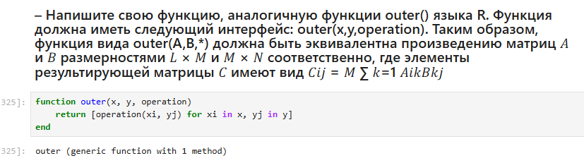{#fig:018 width=70%}

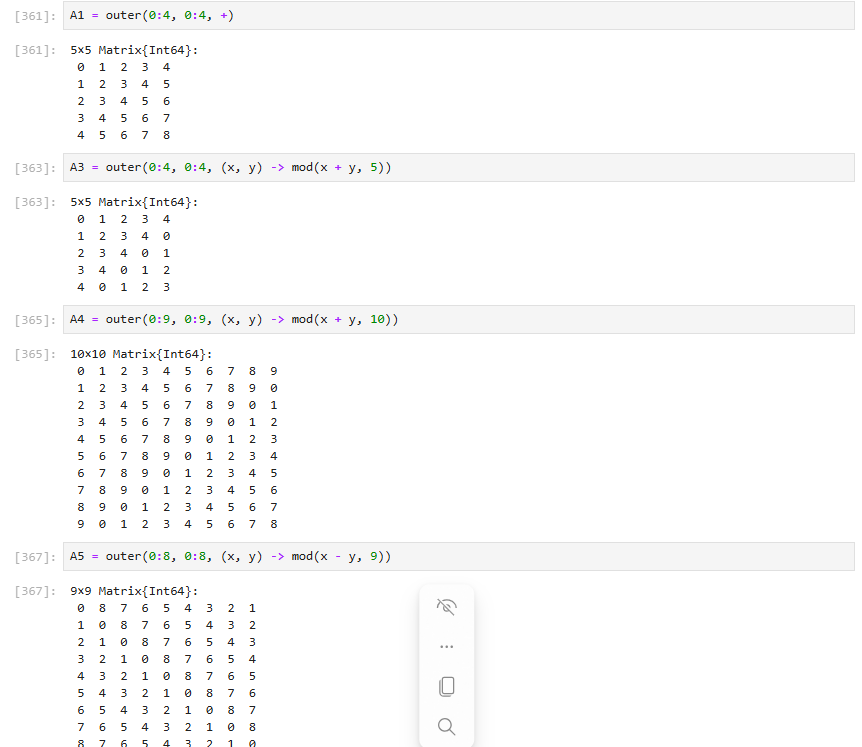{#fig:019 width=70%}

9. Решите следующую систему линейных уравнений с 5 неизвестными (рис. [-@fig:020])

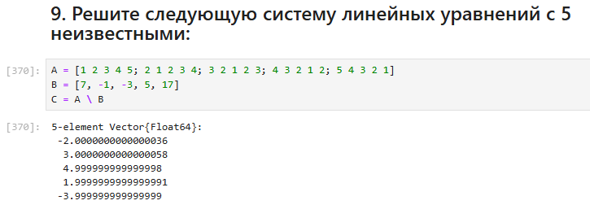{#fig:020 width=70%}

10. Создайте матрицу M размерности 6 × 10, элементами которой являются целые числа,
выбранные случайным образом с повторениями из совокупности 1, 2, ... , 10 (рис. [-@fig:021])

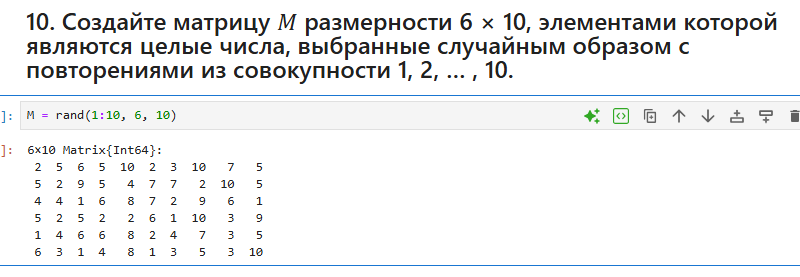{#fig:021 width=70%}

– Найдите число элементов в каждой строке матрицы M, которые больше числа N
(например, N = 4) (рис. [-@fig:022])

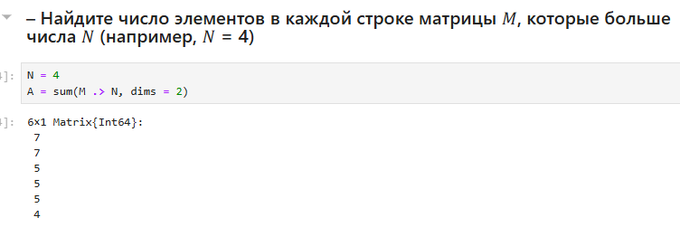{#fig:022 width=70%}

– Определите, в каких строках матрицы M число M (например, M = 7) встречается
ровно 2 раза? (рис. [-@fig:023])

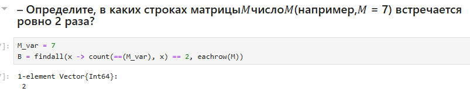{#fig:023 width=70%}

– Определите все пары столбцов матрицы M, сумма элементов которых больше K
(например, K = 75) (рис. [-@fig:024])

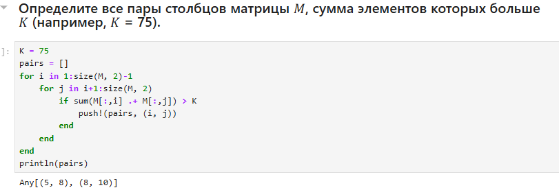{#fig:024 width=70%}

11. Вычислите (рис. [-@fig:025])

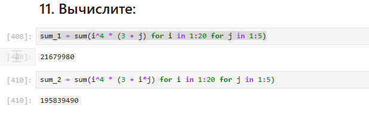{#fig:025 width=70%}

# Выводы

В результате выполнения лабораторной работы подготовили было освоено применение циклов функций и сторонних для Julia пакетов для решения задач линейной алгебры и работы с матрицами.
