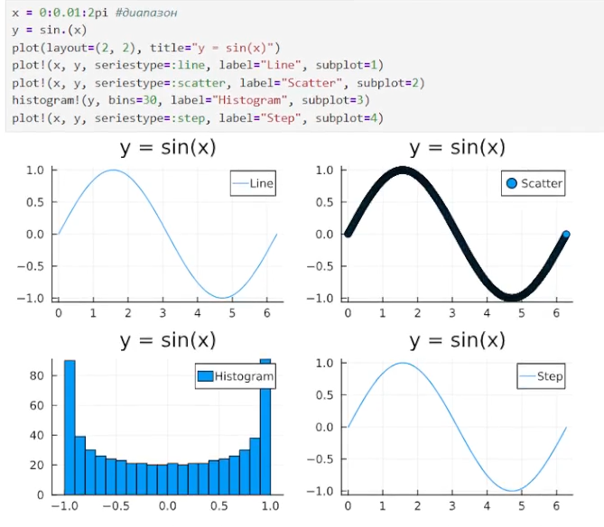
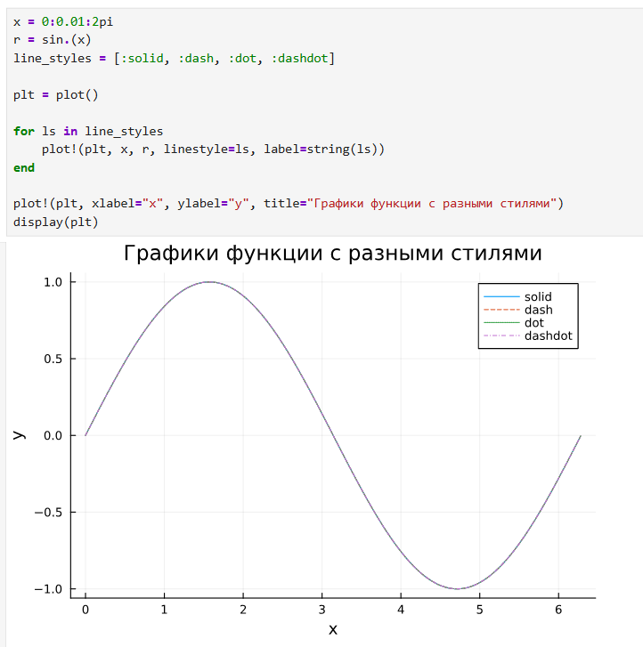
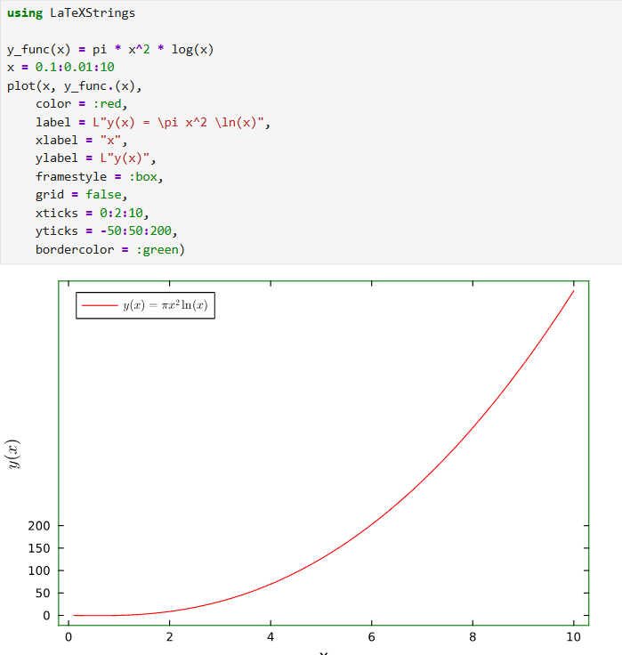
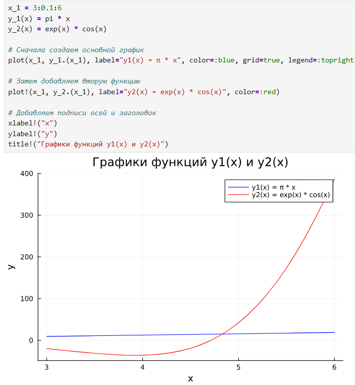
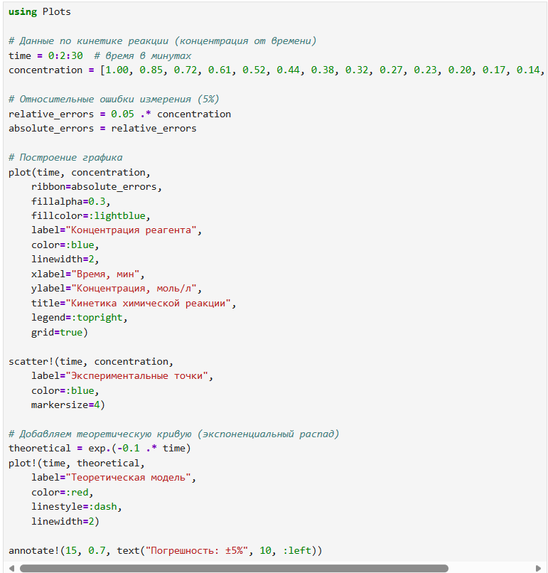
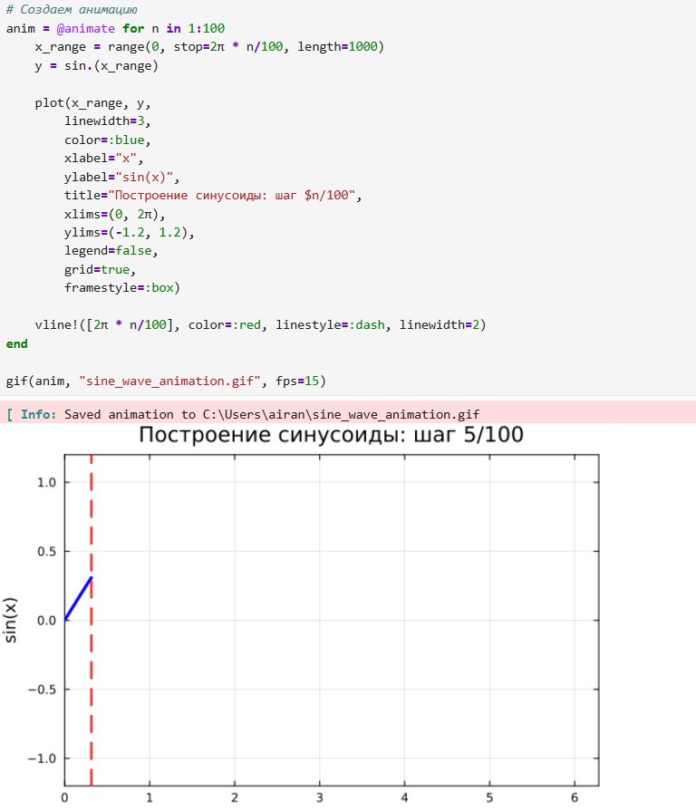

---
## Front matter
title: "Построение графиков"
subtitle: "Лабораторная работа № 4"
author: "Шулуужук Айраана НПИбд-02-22"

## Generic otions
lang: ru-RU
toc-title: "Содержание"

## Bibliography
bibliography: bib/cite.bib
csl: pandoc/csl/gost-r-7-0-5-2008-numeric.csl

## Pdf output format
toc: true # Table of contents
toc-depth: 2
lof: true # List of figures
lot: true # List of tables
fontsize: 12pt
linestretch: 1.5
papersize: a4
documentclass: scrreprt
## I18n polyglossia
polyglossia-lang:
  name: russian
  options:
	- spelling=modern
	- babelshorthands=true
polyglossia-otherlangs:
  name: english
## I18n babel
babel-lang: russian
babel-otherlangs: english
## Fonts
mainfont: IBM Plex Serif
romanfont: IBM Plex Serif
sansfont: IBM Plex Sans
monofont: IBM Plex Mono
mathfont: STIX Two Math
mainfontoptions: Ligatures=Common,Ligatures=TeX,Scale=0.94
romanfontoptions: Ligatures=Common,Ligatures=TeX,Scale=0.94
sansfontoptions: Ligatures=Common,Ligatures=TeX,Scale=MatchLowercase,Scale=0.94
monofontoptions: Scale=MatchLowercase,Scale=0.94,FakeStretch=0.9
mathfontoptions:
## Biblatex
biblatex: true
biblio-style: "gost-numeric"
biblatexoptions:
  - parentracker=true
  - backend=biber
  - hyperref=auto
  - language=auto
  - autolang=other*
  - citestyle=gost-numeric
## Pandoc-crossref LaTeX customization
figureTitle: "Рис."
tableTitle: "Таблица"
listingTitle: "Листинг"
lofTitle: "Список иллюстраций"
lotTitle: "Список таблиц"
lolTitle: "Листинги"
## Misc options
indent: true
header-includes:
  - \usepackage{indentfirst}
  - \usepackage{float} # keep figures where there are in the text
  - \floatplacement{figure}{H} # keep figures where there are in the text
---

# Цель работы

Основная цель работы — освоить синтаксис языка Julia для построения графиков./

# Выполнение лабораторной работы

## Выполнение самостоятельной работы

1. Постройте все возможные типы графиков (простые, точечные, гистограммы и т.д.) функции y = sin(x), x = 0, 2pi. Отобразите все графики в одном графическом окне (рис. [-@fig:001]) 

{#fig:001 width=70%}

2. Постройте графики функции y = sin(x), x = 0, 2pi со всеми возможными (сколько сможете вспомнить) типами оформления линий графика. Отобразите все графики в одном графическом окне (рис. [-@fig:002])

{#fig:002 width=70%}

3. Постройте график функции y(x) = pi*x2 ln(x), назовите оси соответственно. Пусть
цвет рамки будет зелёным, а цвет самого графика — красным. Задайте расстояние
между надписями и осями так, чтобы надписи полностью умещались в графическом
окне. Задайте шрифт надписей. Задайте частоту отметок на осях координат (рис. [-@fig:003]) 

{#fig:003 width=70%}

4. Задайте вектор x = (−2, −1, 0, 1, 2). В одном графическом окне (в 4-х подокнах) изобразите графически по точкам 𝑥 значения функции y(x) = x3 − 3x в виде:
– точек,
– линий,
– линий и точек,
– кривой.
Сохраните полученные изображения в файле figure_familiya.png, где вместо familiya укажите вашу фамилию (рис. [-@fig:004]) 

{#fig:004 width=70%}

{#fig:005 width=70%}

5. Задайте вектор x = (3, 3.1, 3.2, ... , 6). Постройте графики функций y1(x) = pix и y2(x) = exp(x) cos(x) в указанном диапазоне значений аргумента x следующим образом:
– постройте оба графика разного цвета на одном рисунке, добавьте легенду и сетку
для каждого графика; укажите недостатки у данного построения;
– постройте аналогичный график с двумя осями ординат (рис. [-@fig:006]) (рис. [-@fig:007])

{#fig:006 width=70%}

{#fig:007 width=70%}

6. Постройте график некоторых экспериментальных данных (придумайте сами), учиты-
вая ошибку измерения (рис. [-@fig:008]) (рис. [-@fig:009])

{#fig:008 width=70%}

{#fig:009 width=70%}

7. Постройте точечный график случайных данных. Подпишите оси, легенду, название графика (рис. [-@fig:010]).

{#fig:010 width=70%}

8. Постройте 3-мерный точечный график случайных данных. Подпишите оси, легенду, название графика. (рис. [-@fig:011])

{#fig:011 width=70%}

9. Создайте анимацию с построением синусоиды. То есть вы строите последовательность
графиков синусоиды, постепенно увеличивая значение аргумента. После соедините их в анимацию (рис. [-@fig:012]) 

{#fig:012 width=70%}

10. Постройте анимированную гипоциклоиду для 2 целых значений модуля 𝑘 и 2 рацио-
нальных значений модуля к

{#fig:013 width=70%}

# Выводы

В результате выполнения лабораторной работы были изучены синтаксис языка Julia для построения графиков
