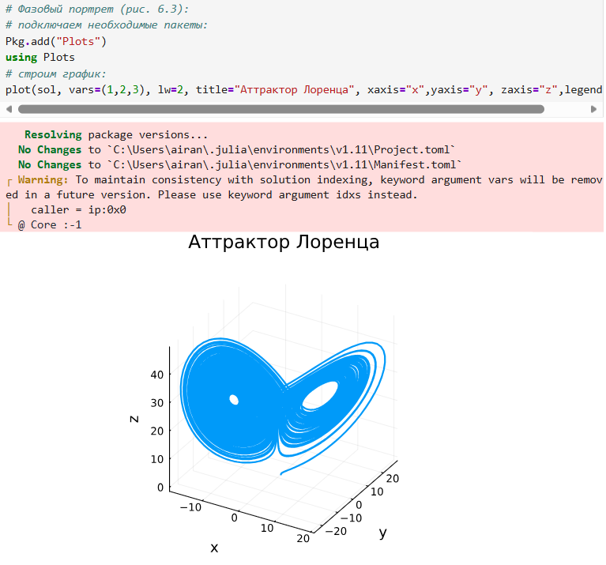
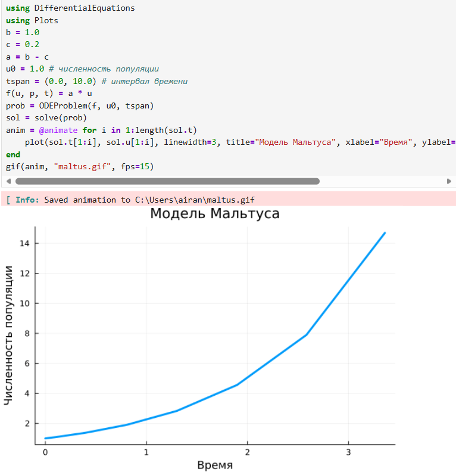
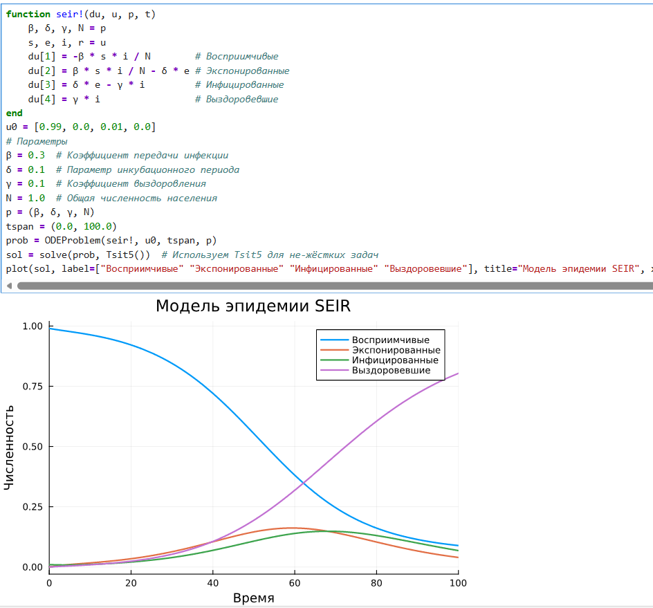
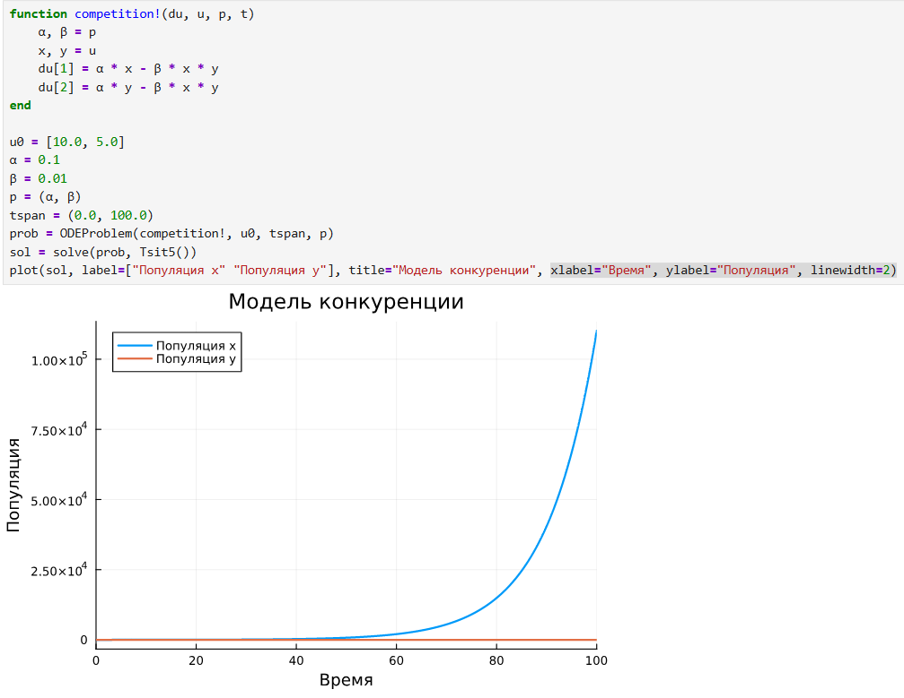

---
## Front matter
lang: ru-RU
title: "Решение моделей в непрерывном и дискретном времени"
subtitle: "Лабораторная работа № 6"
author:
  - Шулуужук А. В.
institute:
  - Российский университет дружбы народов, Москва, Россия
date: 25 октября 2025

## i18n babel
babel-lang: russian
babel-otherlangs: english

## Formatting pdf
toc: false
toc-title: Содержание
slide_level: 2
aspectratio: 169
section-titles: true
theme: metropolis
header-includes:
 - \metroset{progressbar=frametitle,sectionpage=progressbar,numbering=fraction}
 - '\makeatletter'
 - '\beamer@ignorenonframefalse'
 - '\makeatother'
---

## Цели и задачи

Основной целью работы является освоение специализированных пакетов для решения задач в непрерывном и дискретном времени.

# Выполнение лабораторной работы

## Модель экспоненциального роста

{#fig:001 width=50%}

## Модель экспоненциального роста

{#fig:002 width=50%}

## Система Лоренца

{#fig:003 width=50%}

## Система Лоренца

{#fig:004 width=70%}

## Самостоятельная работа

{#fig:005 width=40%}

## Самостоятельная работа

{#fig:006 width=50%}

## Самостоятельная работа

{#fig:007 width=40%}

## Самостоятельная работа

{#fig:008 width=50%}

## Самостоятельная работа

{#fig:009 width=40%}

## Самостоятельная работа

{#fig:010 width=50%}

## Самостоятельная работа

{#fig:011 width=60%}

## Самостоятельная работа

{#fig:012 width=60%}

# Выводы

В результате выполнения лабораторной работы были освоены специализированные пакеты для решения задач в непрерывном и дискретном времени
