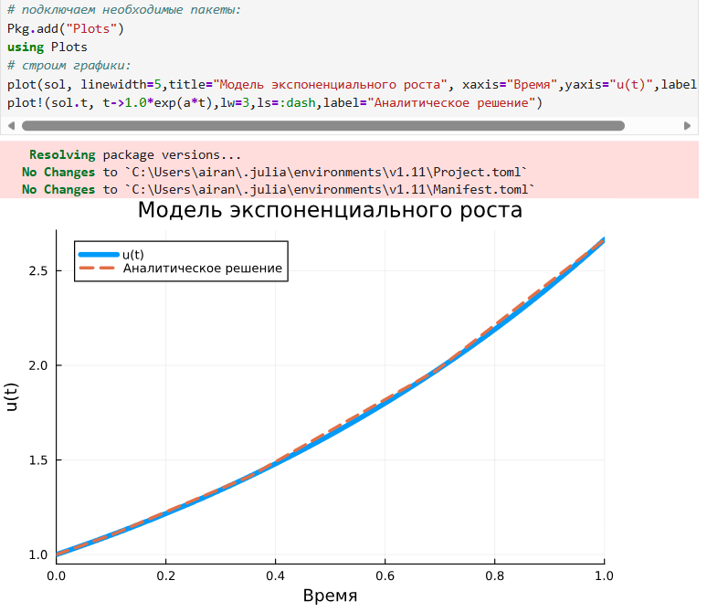
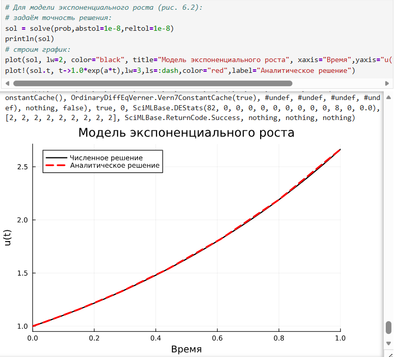
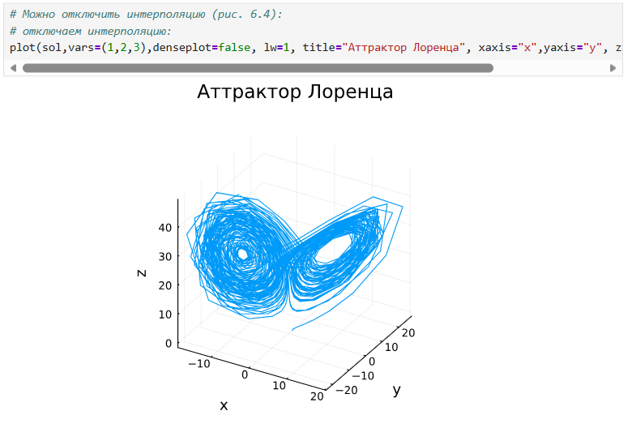
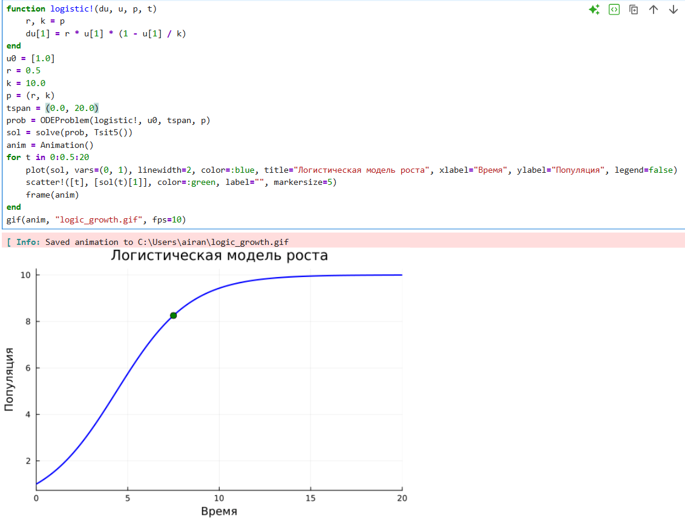
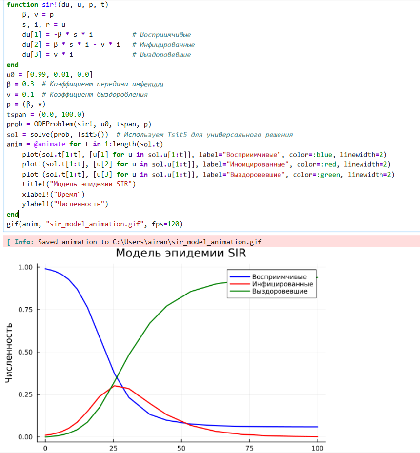
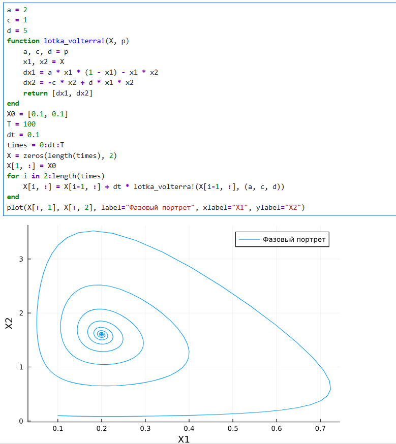
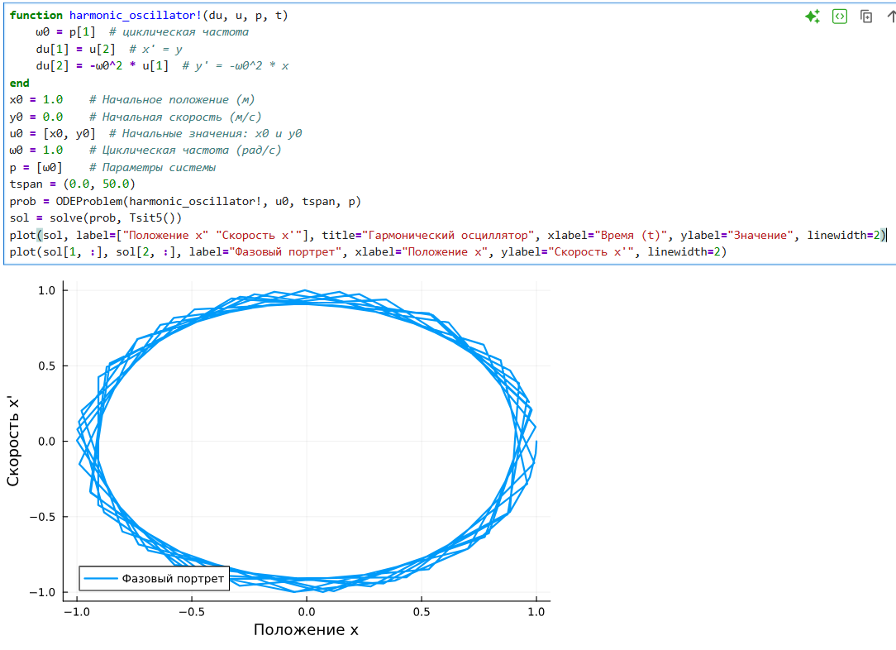
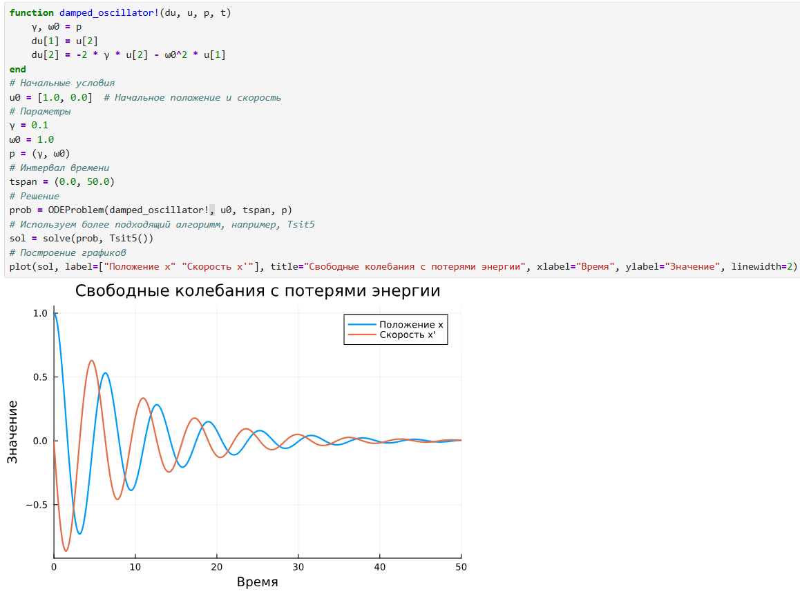

---
## Front matter
title: "Решение моделей в непрерывном и дискретном времени"
subtitle: "Лабораторная работа № 6"
author: "Шулуужук Айраана НПИбд-02-22"

## Generic otions
lang: ru-RU
toc-title: "Содержание"

## Bibliography
bibliography: bib/cite.bib
csl: pandoc/csl/gost-r-7-0-5-2008-numeric.csl

## Pdf output format
toc: true # Table of contents
toc-depth: 2
lof: true # List of figures
lot: true # List of tables
fontsize: 12pt
linestretch: 1.5
papersize: a4
documentclass: scrreprt
## I18n polyglossia
polyglossia-lang:
  name: russian
  options:
	- spelling=modern
	- babelshorthands=true
polyglossia-otherlangs:
  name: english
## I18n babel
babel-lang: russian
babel-otherlangs: english
## Fonts
mainfont: IBM Plex Serif
romanfont: IBM Plex Serif
sansfont: IBM Plex Sans
monofont: IBM Plex Mono
mathfont: STIX Two Math
mainfontoptions: Ligatures=Common,Ligatures=TeX,Scale=0.94
romanfontoptions: Ligatures=Common,Ligatures=TeX,Scale=0.94
sansfontoptions: Ligatures=Common,Ligatures=TeX,Scale=MatchLowercase,Scale=0.94
monofontoptions: Scale=MatchLowercase,Scale=0.94,FakeStretch=0.9
mathfontoptions:
## Biblatex
biblatex: true
biblio-style: "gost-numeric"
biblatexoptions:
  - parentracker=true
  - backend=biber
  - hyperref=auto
  - language=auto
  - autolang=other*
  - citestyle=gost-numeric
## Pandoc-crossref LaTeX customization
figureTitle: "Рис."
tableTitle: "Таблица"
listingTitle: "Листинг"
lofTitle: "Список иллюстраций"
lotTitle: "Список таблиц"
lolTitle: "Листинги"
## Misc options
indent: true
header-includes:
  - \usepackage{indentfirst}
  - \usepackage{float} # keep figures where there are in the text
  - \floatplacement{figure}{H} # keep figures where there are in the text
---

# Цель работы

Основной целью работы является освоение специализированных пакетов для решения задач в непрерывном и дискретном времени.

# Выполнение лабораторной работы

## Модель экспоненциального роста

Рассмотрим пример использования пакета для решение уравнения модели экспоненциального роста, описываемую уравнением u′(t) = au(t), u(0) = u0, где a — коэффициент роста. Предположим, что заданы следующие начальные данные a = 0.98, u(0) = 1.0, t ∈ [0; 1.0]
Аналитическое решение модели имеет вид: u(t) = u_0 exp(at)u(t) (рис. [-@fig:001]) (рис. [-@fig:002])

{#fig:001 width=70%}

{#fig:002 width=70%}

## Система Лоренца

Динамической системой Лоренца является нелинейная автономная система обыкновенных дифференциальных уравнений третьего порядка. Система (6.2) получена из системы уравнений Навье–Стокса и описывает движение воздушных потоков в плоском слое жидкости постоянной толщины при разложении скорости течения и температуры в двойные ряды Фурье с последующем усечением до первых-вторых гармоник. Решение системы неустойчиво на аттракторе, что не позволяет применять классические численные методы на больших отрезках времени, требуется использовать высокоточные вычисления (рис. [-@fig:003]) (рис. [-@fig:004]) 

{#fig:003 width=70%}

{#fig:004 width=70%}

## Самостоятельная работа

1. Реализовать и проанализировать модель роста численности изолированной популяции (модель Мальтуса)

{#fig:005 width=70%}

2. Реализовать и проанализировать логистическую модель роста популяции, заданную уравнением (рис. [-@fig:006]) 

{#fig:006 width=70%}

3. Реализовать и проанализировать модель эпидемии Кермака–Маккендрика (SIR-модель) (рис. [-@fig:007])

{#fig:007 width=70%}

4. Как расширение модели SIR (Susceptible-Infected-Removed) по результатом эпидемии испанки была предложена модель SEIR (Susceptible-Exposed-Infected-Removed) (рис. [-@fig:008])

{#fig:008 width=70%}

5. Для дискретной модели Лотки–Вольтерры с начальными данными a = 2, c = 1, d = 5 найдите точку равновесия. Получите и сравните аналитическое и численное решения. Численное решение изобразите на фазовом портрете (рис. [-@fig:009])

{#fig:009 width=70%}

6. Реализовать на языке Julia модель отбора на основе конкурентных отношений (рис. [-@fig:010]).

{#fig:010 width=70%}

7. Реализовать на языке Julia модель консервативного гармонического осциллятора (рис. [-@fig:011])

{#fig:011 width=70%}

8. Реализовать на языке Julia модель свободных колебаний гармонического осциллятора (рис. [-@fig:012]) 

{#fig:012 width=70%}

# Выводы

В результате выполнения лабораторной работы были освоены специализированные пакеты для решения задач в непрерывном и дискретном времени
