---
## Front matter
lang: ru-RU
title: "Введение в работу с данными"
subtitle: "Лабораторная работа № 7"
author:
  - Шулуужук А. В.
institute:
  - Российский университет дружбы народов, Москва, Россия
date: 25 ноябрь 2025

## i18n babel
babel-lang: russian
babel-otherlangs: english

## Formatting pdf
toc: false
toc-title: Содержание
slide_level: 2
aspectratio: 169
section-titles: true
theme: metropolis
header-includes:
 - \metroset{progressbar=frametitle,sectionpage=progressbar,numbering=fraction}
 - '\makeatletter'
 - '\beamer@ignorenonframefalse'
 - '\makeatother'
---

## Цели и задачи

Основной целью работы является специализированных пакетов Julia для обработки данных.

# Выполнение лабораторной работы

## Считывание данных

{#fig:001 width=70%}

## Считывание данных

{#fig:002 width=70%}

## Запись данных в файл

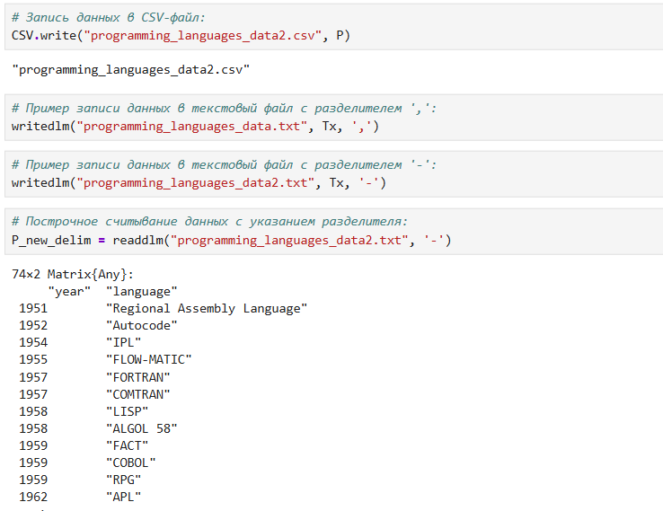{#fig:003 width=50%}

## Словари

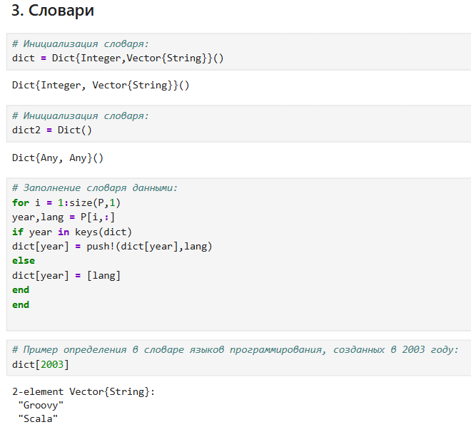{#fig:004 width=40%}

## DataFrames

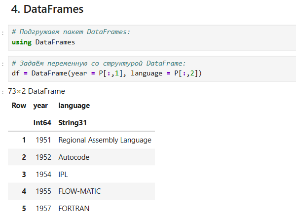{#fig:005 width=50%}

## DataFrames

{#fig:006 width=70%}

## RDatasets

{#fig:007 width=40%}

## RDatasets

{#fig:008 width=70%}

## Работа с переменными отсутствующего типа (Missing Values)

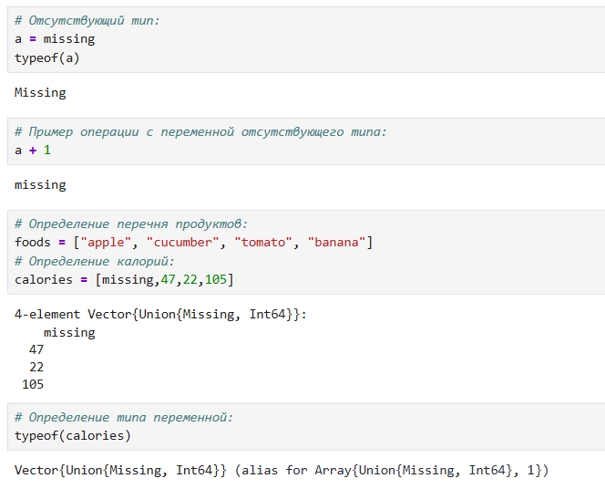{#fig:009 width=40%}

## Работа с переменными отсутствующего типа (Missing Values)

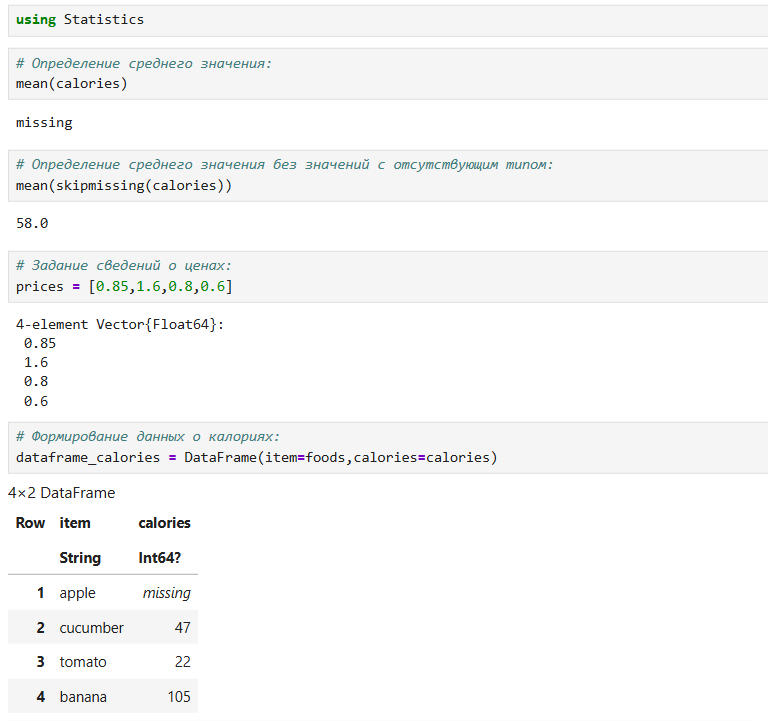{#fig:010 width=40%}

## Кластеризация данных. Метод k-средних

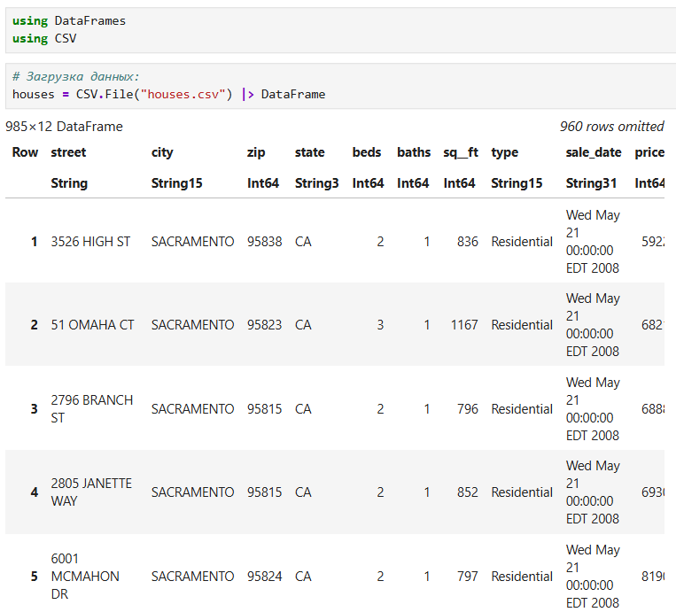{#fig:011 width=40%}

## Кластеризация данных. Метод k-средних

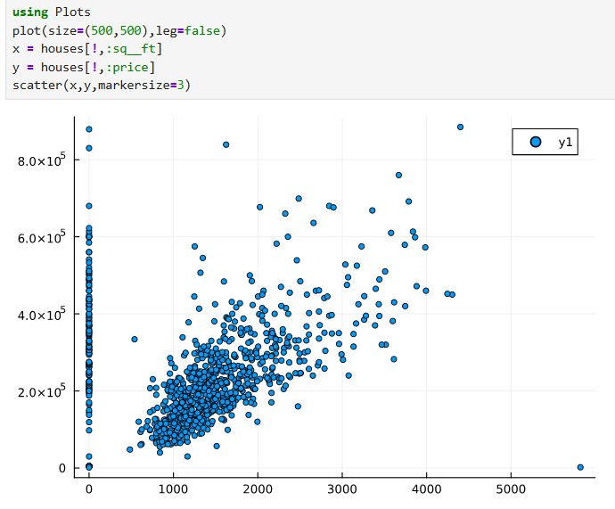{#fig:012 width=40%}

## Кластеризация данных. Метод k-средних

{#fig:013 width=40%}

## Кластеризация данных. Метод k-средних

{#fig:014 width=40%}

## Кластеризация данных. Метод k-средних

{#fig:015 width=40%}

## Кластеризация данных. Метод k-средних

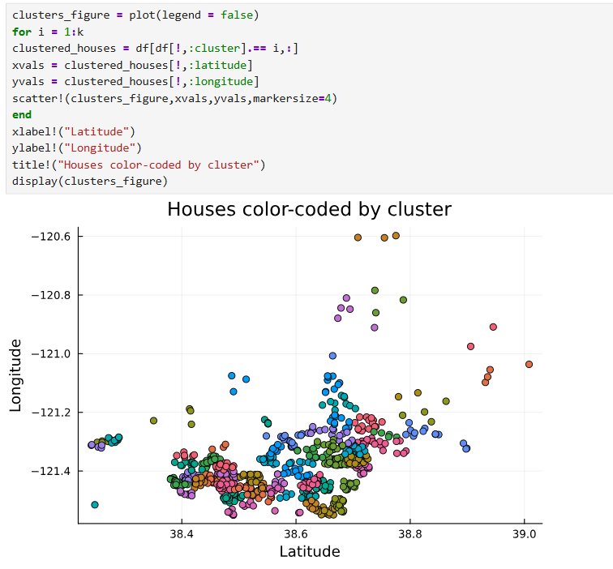{#fig:016 width=50%}

## Кластеризация данных. Метод k-средних

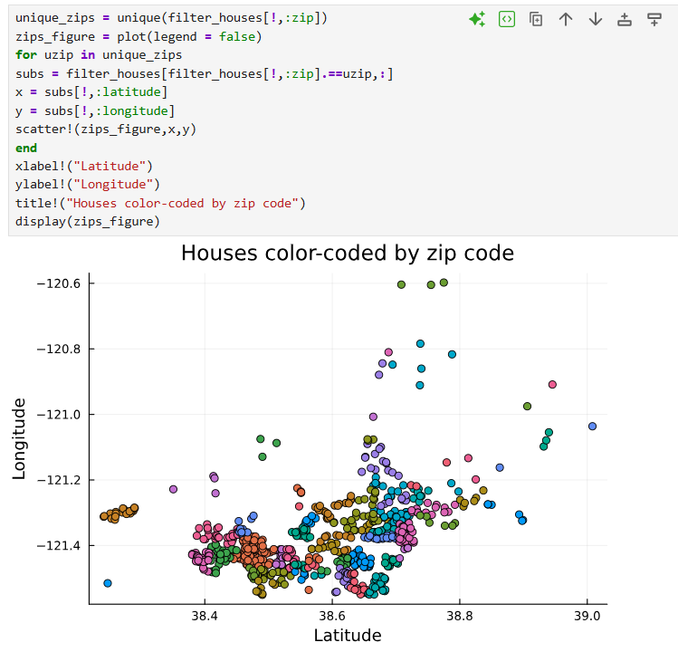{#fig:017 width=50%}

## Кластеризация данных. Метод k ближайших соседей

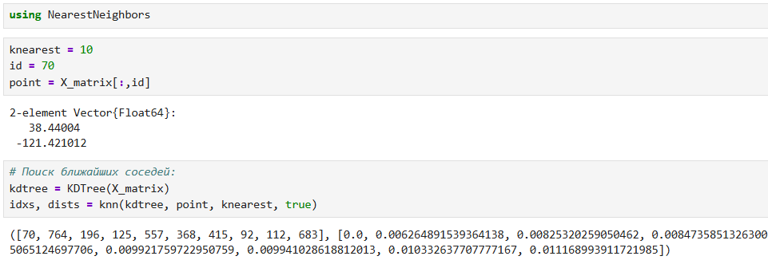{#fig:018 width=70%}

## Кластеризация данных. Метод k ближайших соседей

{#fig:019 width=50%}

## Обработка данных. Метод главных компонент

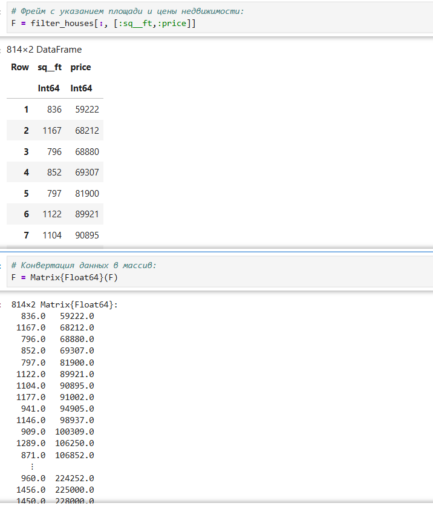{#fig:020 width=40%}

## Обработка данных. Метод главных компонент

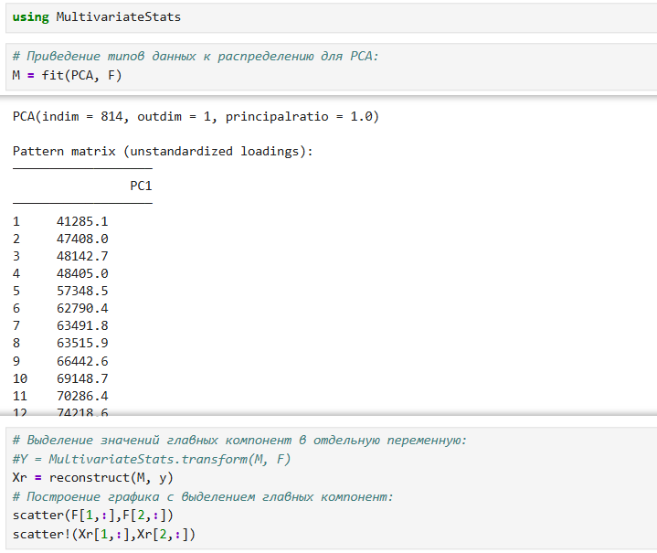{#fig:021 width=40%}

## Обработка данных. Линейная регрессия

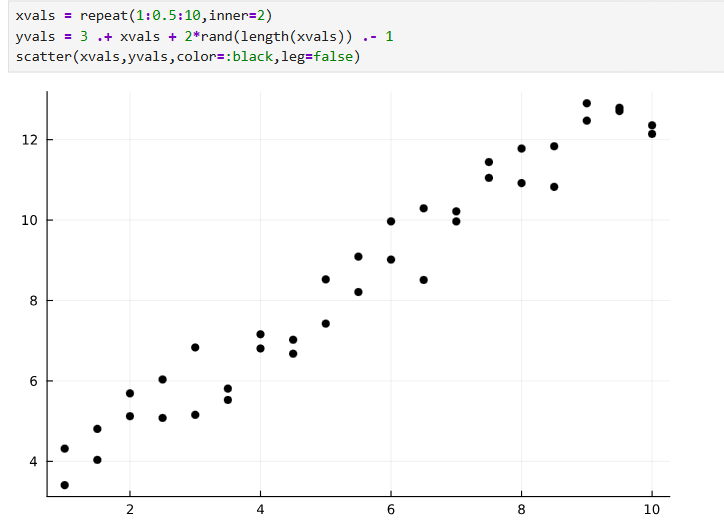{#fig:022 width=60%}

## Обработка данных. Линейная регрессия

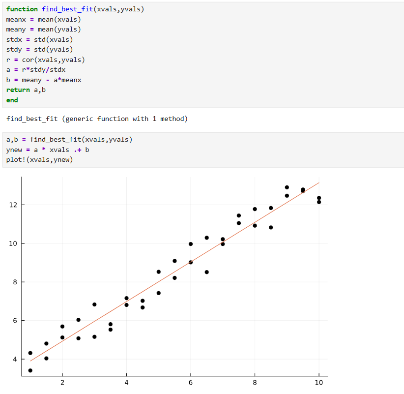{#fig:023 width=40%}

## Обработка данных. Линейная регрессия

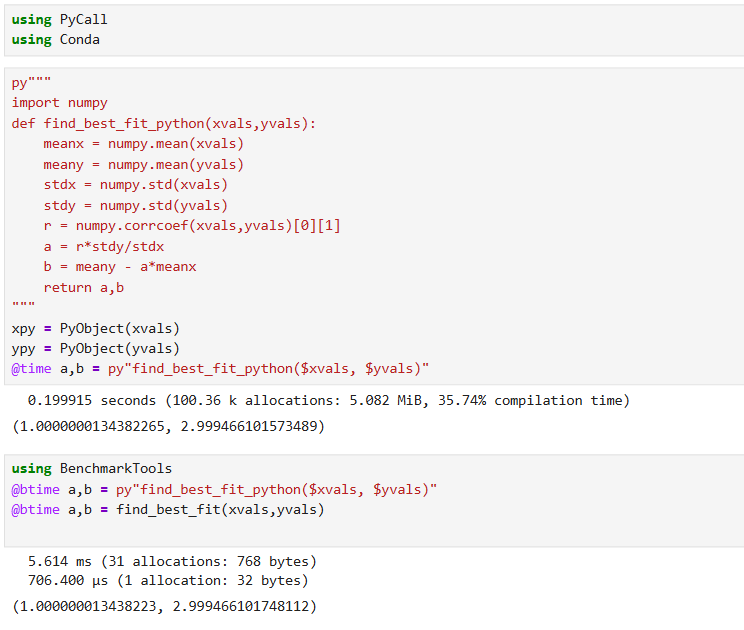{#fig:024 width=40%}

## Самостоятельная работа. Кластеризация

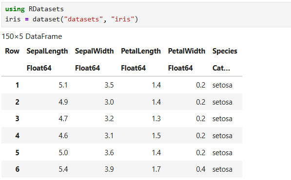{#fig:025 width=70%}

## Самостоятельная работа. Кластеризация

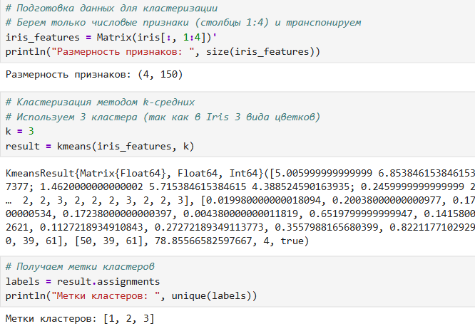{#fig:026 width=60%}

## Самостоятельная работа. Кластеризация

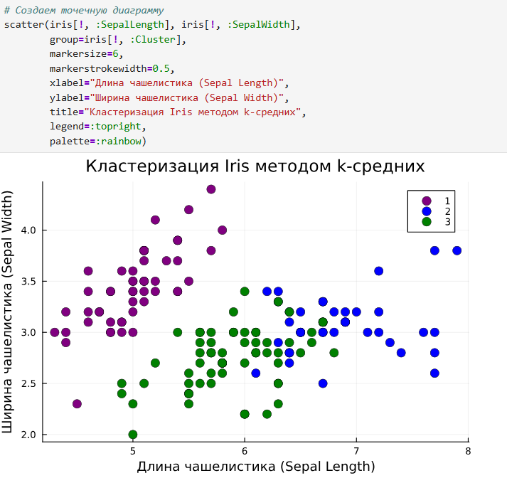{#fig:027 width=50%}

## Самостоятельная работа. Регрессия (метод наименьших квадратов в случае линейной регрессии) 

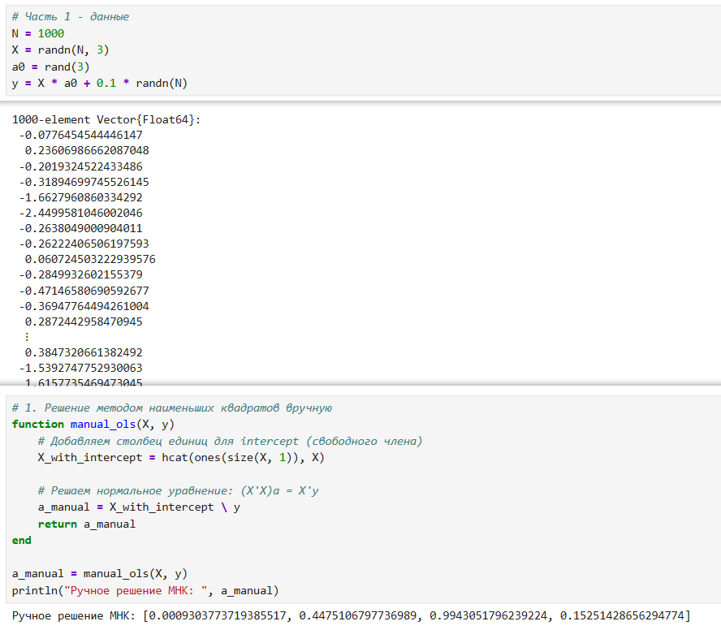{#fig:028 width=40%}

## Самостоятельная работа. Регрессия (метод наименьших квадратов в случае линейной регрессии) 

{#fig:029 width=50%}

## Самостоятельная работа. Регрессия (метод наименьших квадратов в случае линейной регрессии) 

{#fig:030 width=70%}

## Самостоятельная работа. Регрессия (метод наименьших квадратов в случае линейной регрессии) 

{#fig:031 width=40%}

## Самостоятельная работа. Регрессия (метод наименьших квадратов в случае линейной регрессии) 

{#fig:032 width=40%}

## Самостоятельная работа. Регрессия (метод наименьших квадратов в случае линейной регрессии) 

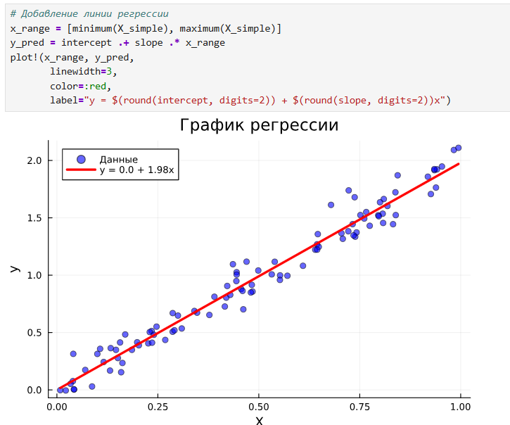{#fig:033 width=40%}

## Самостоятельная работа. Модель ценообразования биномиальных опционов

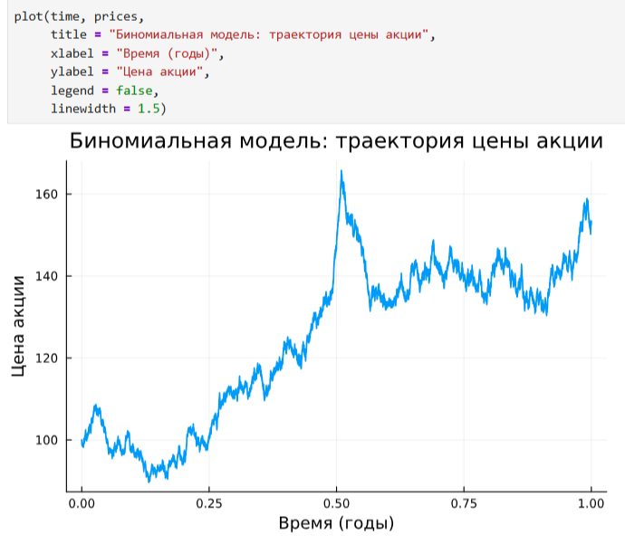{#fig:034 width=40%}

## Самостоятельная работа. Модель ценообразования биномиальных опционов

{#fig:035 width=70%}

## Самостоятельная работа. Модель ценообразования биномиальных опционов

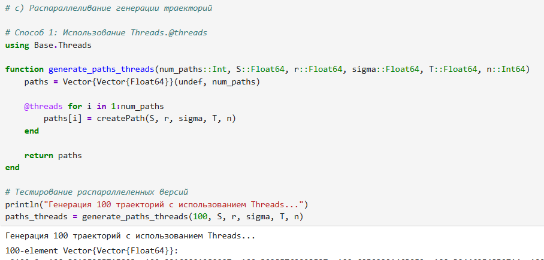{#fig:036 width=70%}

## Самостоятельная работа. Модель ценообразования биномиальных опционов

{#fig:037 width=70%}

# Выводы

Основной целью работы является специализированных пакетов Julia для обработки данных.
