---
## Front matter
title: "Введение в работу с данными"
subtitle: "Лабораторная работа № 7"
author: "Шулуужук Айраана НПИбд-01-22"

## Generic otions
lang: ru-RU
toc-title: "Содержание"

## Bibliography
bibliography: bib/cite.bib
csl: pandoc/csl/gost-r-7-0-5-2008-numeric.csl

## Pdf output format
toc: true # Table of contents
toc-depth: 2
lof: true # List of figures
lot: true # List of tables
fontsize: 12pt
linestretch: 1.5
papersize: a4
documentclass: scrreprt
## I18n polyglossia
polyglossia-lang:
  name: russian
  options:
	- spelling=modern
	- babelshorthands=true
polyglossia-otherlangs:
  name: english
## I18n babel
babel-lang: russian
babel-otherlangs: english
## Fonts
mainfont: IBM Plex Serif
romanfont: IBM Plex Serif
sansfont: IBM Plex Sans
monofont: IBM Plex Mono
mathfont: STIX Two Math
mainfontoptions: Ligatures=Common,Ligatures=TeX,Scale=0.94
romanfontoptions: Ligatures=Common,Ligatures=TeX,Scale=0.94
sansfontoptions: Ligatures=Common,Ligatures=TeX,Scale=MatchLowercase,Scale=0.94
monofontoptions: Scale=MatchLowercase,Scale=0.94,FakeStretch=0.9
mathfontoptions:
## Biblatex
biblatex: true
biblio-style: "gost-numeric"
biblatexoptions:
  - parentracker=true
  - backend=biber
  - hyperref=auto
  - language=auto
  - autolang=other*
  - citestyle=gost-numeric
## Pandoc-crossref LaTeX customization
figureTitle: "Рис."
tableTitle: "Таблица"
listingTitle: "Листинг"
lofTitle: "Список иллюстраций"
lotTitle: "Список таблиц"
lolTitle: "Листинги"
## Misc options
indent: true
header-includes:
  - \usepackage{indentfirst}
  - \usepackage{float} # keep figures where there are in the text
  - \floatplacement{figure}{H} # keep figures where there are in the text
---

# Цель работы

Основной целью работы является специализированных пакетов Julia для обработки данных.

# Выполнение лабораторной работы

## Считывание данных

Перед тем, как начать проводить какие-либо операции над данными, необходимо их
откуда-то считать и возможно сохранить в определённой структуре.
Довольно часто данные для обработки содержаться в csv-файле, имеющим текстовый
формат, в котором данные в строке разделены, например, запятыми, и соответствуют
ячейкам таблицы, а строки данных соответствуют строкам таблицы. Также данные могут
быть представлены в виде фреймов или множеств.
В Julia для работы с такого рода структурами данных используют пакеты CSV,
DataFrames, RDatasets, FileIO. Предположим, что у вас в рабочем каталоге с проектом есть файл с данными
programminglanguages.csv, содержащий перечень языков программирования и год их
создания. Тогда для заполнения массива данными для последующей обработки требуется
считать данные из исходного файла и записать их в соответствующую структуру (рис. [-@fig:001])

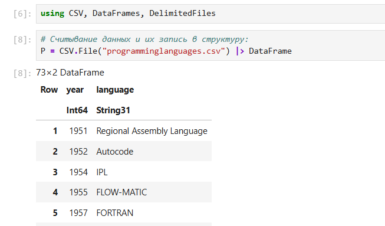{#fig:001 width=70%}

Далее приведём пример функции, в которой на входе указывается название языка
программирования, а на выходе — год его создания (рис. [-@fig:002])

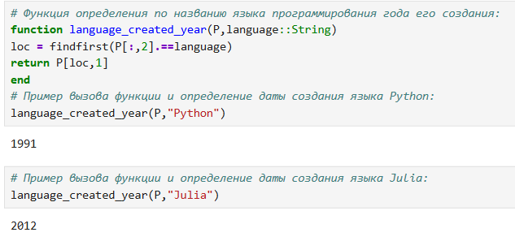{#fig:002 width=70%}

## Запись данных в файл

Предположим, что требуется записать имеющиеся данные в файл. Для записи данных
в формате CSV можно воспользоваться следующим вызовом. Можно задать тип файла и разделитель данных. Можно проверить, используя readdlm, корректность считывания созданного текстового файла (рис. [-@fig:003]) 

{#fig:003 width=70%}

## Словари

При работе с данными бывает удобно записать их в формате словаря.
Предположим, что словарь должен содержать перечень всех языков программирования
и года их создания, при этом при указании года выводить все языки программирования,
созданные в этом году. При инициализации словаря можно задать конкретные типы данных для ключей
и значений (рис. [-@fig:004]) 

{#fig:004 width=70%}

## DataFrames

Работа с данными, записанными в структуре DataFrame, позволяет использовать индексацию и получить доступ к столбцам по заданному имени заголовка или по индексу столбца. На примере с данными о языках программирования и годах их создания зададим структуру DataFrame (рис. [-@fig:005]) (рис. [-@fig:006])

{#fig:005 width=70%}

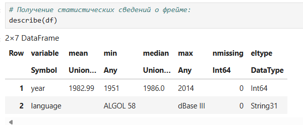{#fig:006 width=70%}

## RDatasets

С данными можно работать также как с наборами данных через пакет RDatasets
языка R (рис. [-@fig:007])

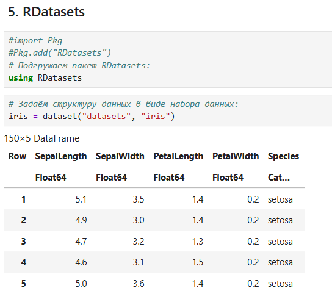{#fig:007 width=70%}

В данном случает набор данных содержит сведения о цветах. При этом следует иметь
в виду, что данные, загруженные с помощью набора данных, хранятся в виде DataFrame. Пакет RDatasets также предоставляет возможность с помощью description получить
основные статистические сведения о каждом столбце в наборе данных (рис. [-@fig:008])

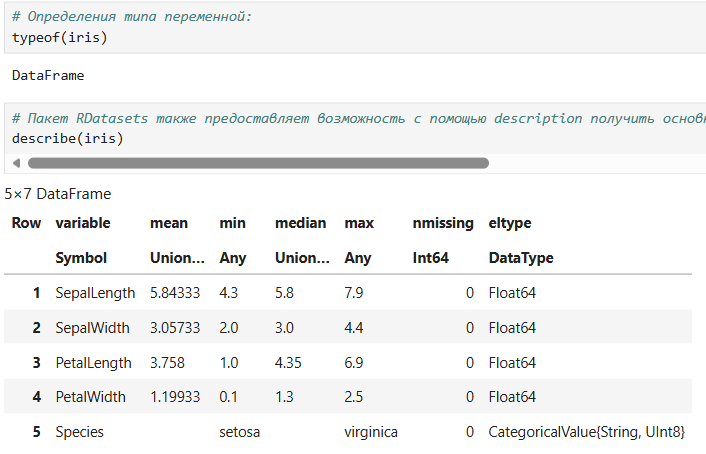{#fig:008 width=70%}

## Работа с переменными отсутствующего типа (Missing Values)

Пакет DataFrames позволяет использовать так называемый «отсутствующий» тип. В операции сложения числа и переменной с отсутствующим типом значение также будет иметь отсутствующий тип (рис. [-@fig:009]) (рис. [-@fig:010])

{#fig:009 width=70%}

{#fig:010 width=70%}

## Кластеризация данных. Метод k-средних

Рассмотрим задачу кластеризации данных на примере данных о недвижимости. Файл
с данными houses.csv содержит список транзакций с недвижимостью в районе Сакраменто, о которых было сообщено в течение определённого числа дней.
Сначала подключим необходимые для работы пакеты и загрузим данные (рис. [-@fig:011])

{#fig:011 width=70%}

Построим график цен на недвижимость в зависимости от площади. Как видно из графика, имеются так называемые «артефакты», т.е. проявляются отсутствующие или невозможные сведения в исходных данных, например, цены на
недвижимость нулевой площади (рис. [-@fig:012]) 

{#fig:012 width=70%}

Для того чтобы избавиться от такого эффекта, можно отфильтровать и исключить такие
значения, получить более корректный график цен (рис. [-@fig:013]) 

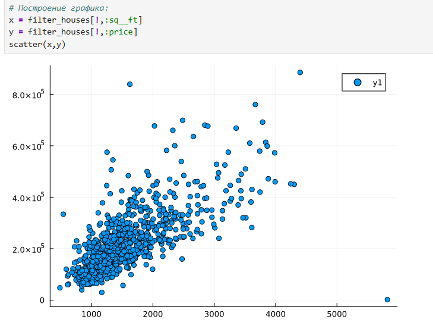{#fig:013 width=70%}

Используя для фильтрации значений функцию by пакета DataFrames и для вычисления
среднего значения функцию mean пакета Statistics, можно посмотреть среднюю цену
домов определённого тип. Отфильтровав таким образом данные, можно приступить к формированию кластеров.
Сначала подключаем необходимые пакеты и формируем данные в нужном виде (рис. [-@fig:014]) 

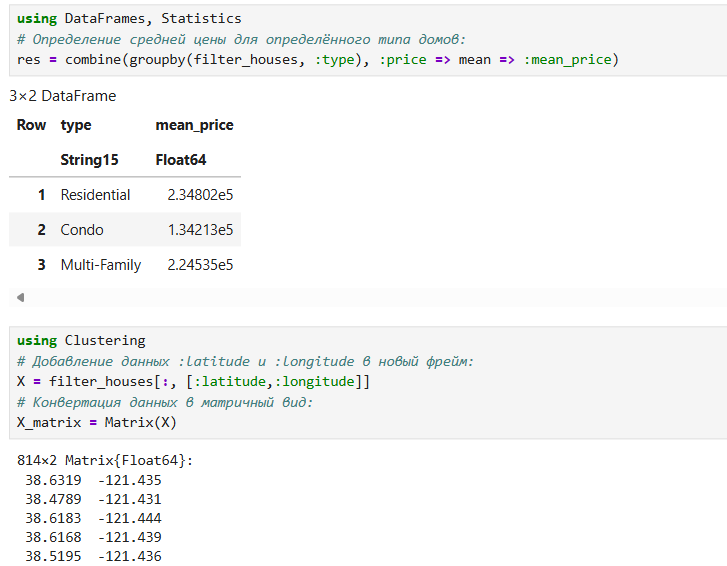{#fig:014 width=70%}

Каждая функция хранится в виде строки X, но можно транспонировать получившуюся матрицу, чтобы иметь возможность работать с столбцами данных X. В качестве критерия для формирования кластеров данных и определения количества
кластеров попробуем использовать количество почтовых индексов. Для определения k-среднего можно воспользоваться соответствующей функцией пакета Statistics (рис. [-@fig:015]) 

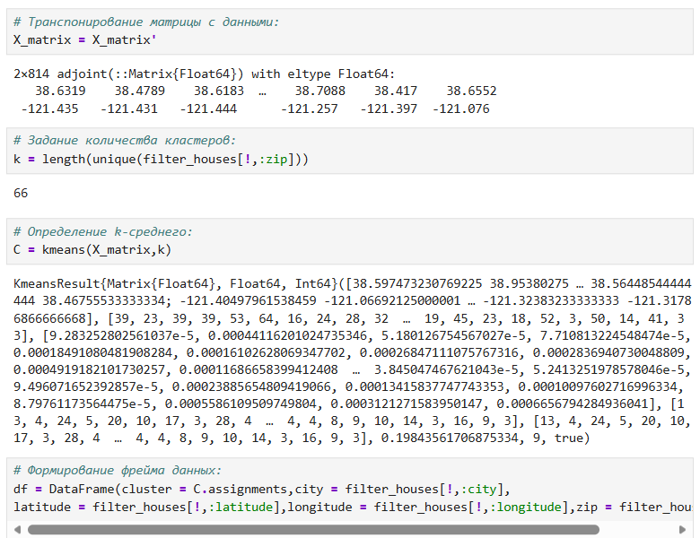{#fig:015 width=70%}

Построим график (рис. 7.3), обозначив каждый кластер отдельным цветом (рис. [-@fig:016]) 

{#fig:016 width=70%}

Построим график (рис. 7.4), раскрасив кластеры по почтовому индексу (рис. [-@fig:017]) 

{#fig:017 width=70%}

## Кластеризация данных. Метод k ближайших соседей

Данный метод заключается в отнесении объекта к тому из известных классов, кото-
рый является наиболее распространённым среди 𝑘 соседей данного элемента. В случае
использования метода для регрессии, объекту присваивается среднее значение по k
ближайшим к нему объектам.
Рассмотрим использование метода k ближайших соседей на примере того же файла
с данными об объектах недвижимости в Сакраменто.
Подключим необходимый пакет (рис. [-@fig:018])

{#fig:018 width=70%}

Отобразим на графике соседей выбранного объекта недвижимости (рис. [-@fig:019]) 

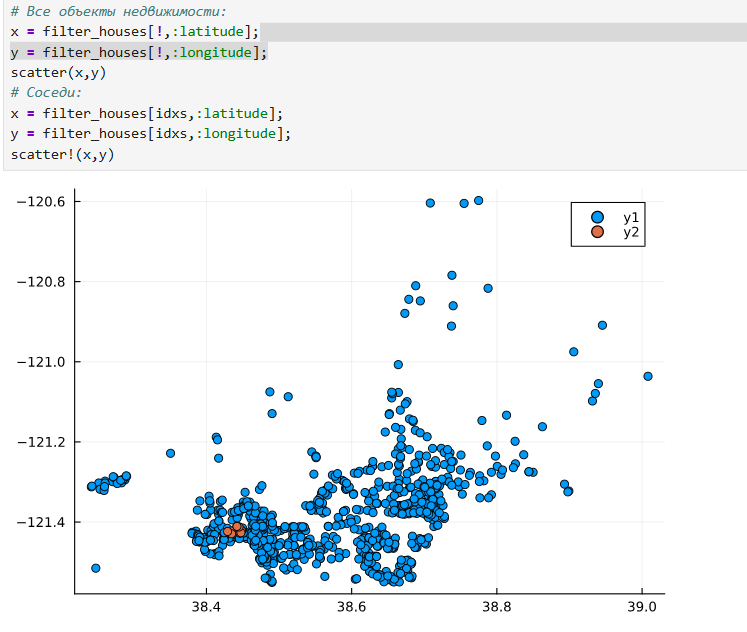{#fig:019 width=70%}

## Обработка данных. Метод главных компонент

Метод главных компонент (Principal Components Analysis, PCA) позволяет уменьшить
размерность данных, потеряв наименьшее количество полезной информации. Метод
имеет широкое применение в различных областях знаний, например, при визуализации
данных, компрессии изображений, в эконометрике, некоторых гуманитарных предмет-
ных областях, например, в социологии или в политологии. На примере с данными о недвижимости попробуем уменьшить размеры данных о цене
и площади из набора данных домов (рис. [-@fig:020]) 

{#fig:020 width=70%}

Далее подключим пакет MultivariateStats, чтобы использовать метод главных ком-
понент. Далее используем специальную функцию fit и приведём имеющийся набор данных
к распределению, к которому можно применить метод главных компонент (PCA). Далее воспользуемся функцией reconstruct, чтобы выделить данные с главными
компонентами в отдельную переменную Xr, значения которой в последствии можно
вывести на графике (рис. [-@fig:021]) 

{#fig:021 width=70%}

## Обработка данных. Линейная регрессия

Регрессионный анализ представляет собой набор статистических методов иссле-
дования влияния одной или нескольких независимых переменных (регрессоров) на
зависимую (критериальная) переменную. Терминология зависимых и независимых
переменных отражает лишь математическую зависимость переменных, а не причинно-
следственные отношения.
Наиболее распространённый вид регрессионного анализа — линейная регрессия, когда
находят линейную функцию, которая согласно определённым математическим критери-
ям наиболее соответствует данным.
Зададим случайный набор данных (можно использовать и полученные эксперимен-
тальным путём какие-то данные). Попробуем найти для данных лучшее соответствие (рис. [-@fig:022]) 

{#fig:022 width=70%}

Определим функцию линейной регрессии. Применим функцию линейной регрессии для построения соответствующего графика
значений (рис. [-@fig:023]) 

{#fig:023 width=70%}

Сгенерируем больший набор данных. Определим, сколько времени потребуется, чтобы найти соответствие этим данным. Для сравнения реализуем подобный код на языке Python (рис. [-@fig:024]) 

{#fig:024 width=70%}

## Самостоятельная работа

1. Кластеризация

Загрузим пакет: using RDatasets
iris = dataset("datasets", "iris") (рис. [-@fig:025]) (рис. [-@fig:026]) (рис. [-@fig:027]) 

{#fig:025 width=70%}

{#fig:026 width=70%}

{#fig:027 width=70%}

2. Регрессия (метод наименьших квадратов в случае линейной регрессии) 

1 часть: Пусть регрессионная зависимость является линейной. Матрица наблюдений
факторов X имеет размерность N * 3 randn (N, 3), массив результатов N * 1, регрессионная зависимость является линейной. Найдите МНК-оценку для линейной модели.
– Сравните свои результаты с результатами использования llsq из
MultivariateStats.jl (просмотрите документацию).
– Сравните свои результаты с результатами использования регулярной регрессии наи-
меньших квадратов из GLM.jl.
Подсказка. Cоздайте матрицу данных X2, которая добавляет столбец единиц в начало матрицы данных, и решите систему линейных уравнений. Объясните с помощью
теоретических выкладок (рис. [-@fig:028]) (рис. [-@fig:029]) (рис. [-@fig:030]) 

{#fig:028 width=70%}

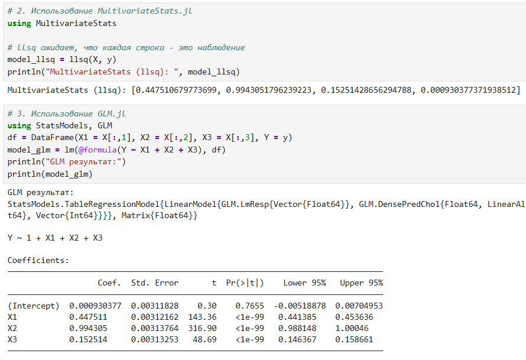{#fig:029 width=70%}

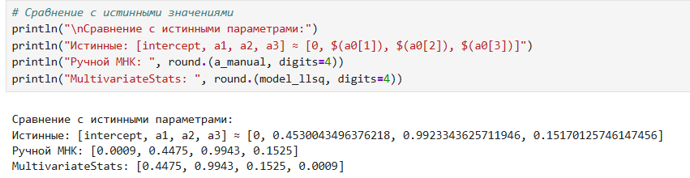{#fig:030 width=70%}

2 часть: Найдите линию регрессии, используя данные (X, y). Постройте график (X, y),
используя точечный график. Добавьте линию регрессии, используя abline!. Добавьте
заголовок «График регрессии» и подпишите оси x и y (рис. [-@fig:031]) (рис. [-@fig:032]) (рис. [-@fig:033]) 

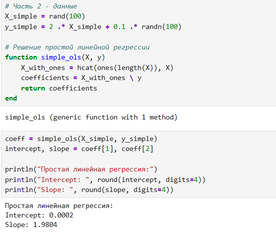{#fig:031 width=70%}

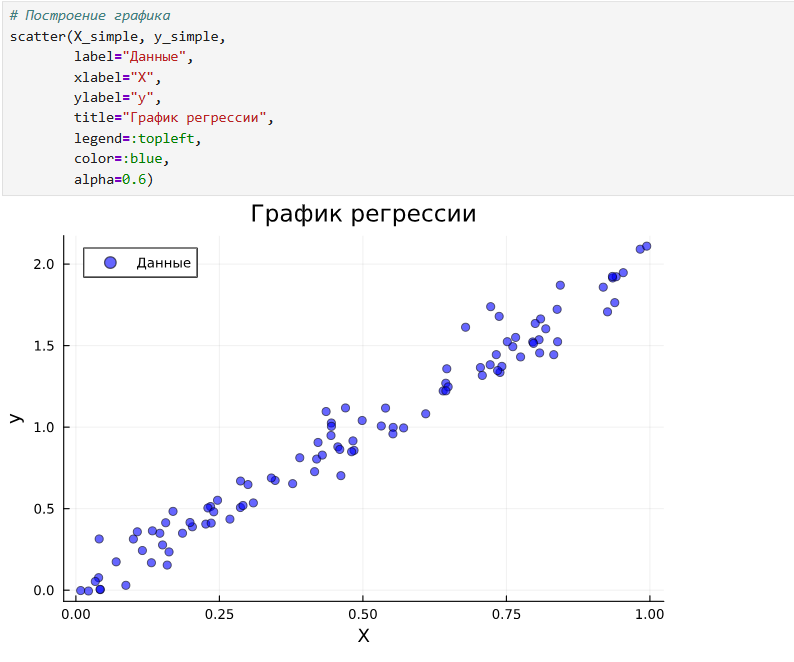{#fig:032 width=70%}

{#fig:033 width=70%}

3. Модель ценообразования биномиальных опционов

(рис. [-@fig:034]) (рис. [-@fig:035]) (рис. [-@fig:036]) (рис. [-@fig:037]) 

{#fig:034 width=70%}

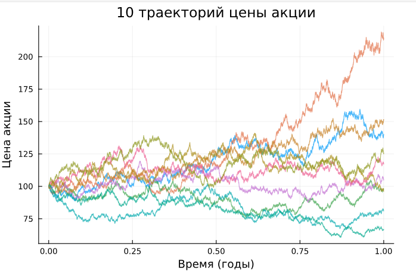{#fig:035 width=70%}

{#fig:036 width=70%}

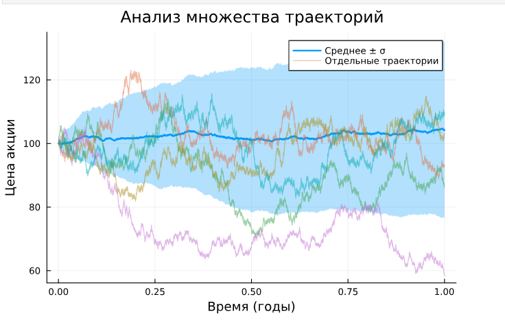{#fig:037 width=70%}

# Выводы

В результате выполнения лабораторной работы были освоены специализированные пакеты для обработки данных
