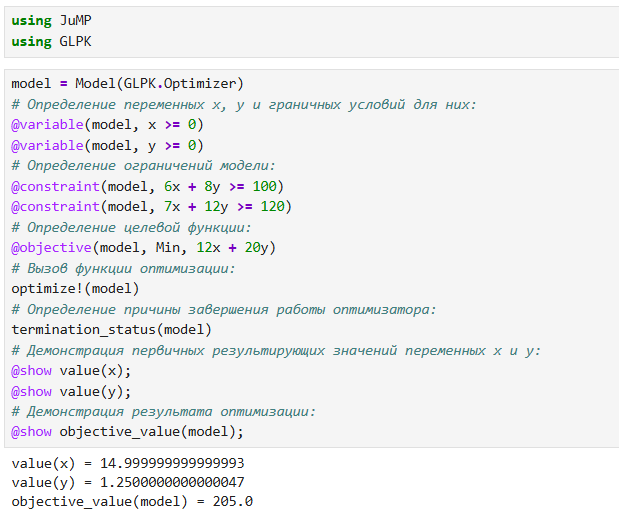
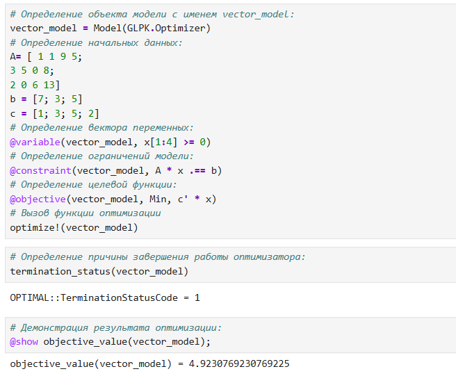
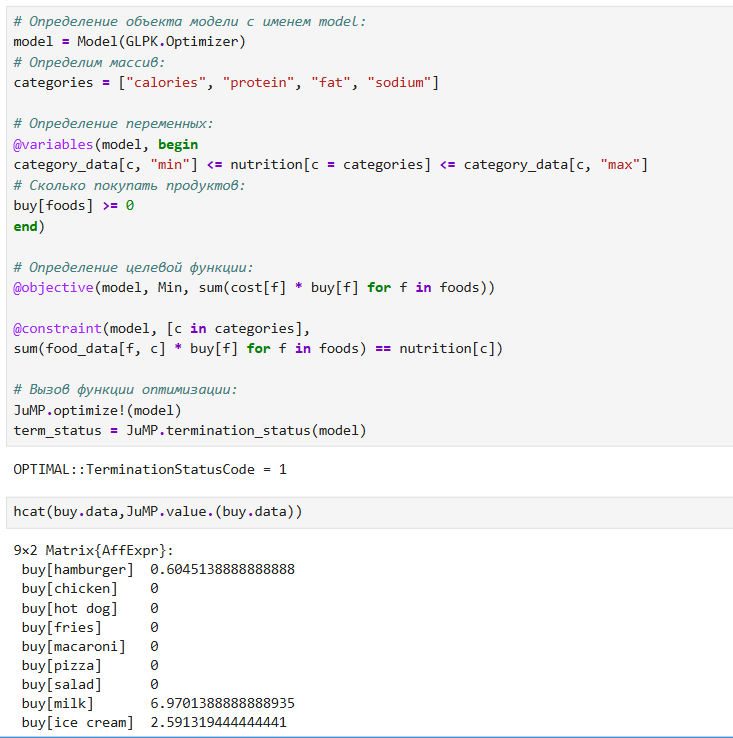
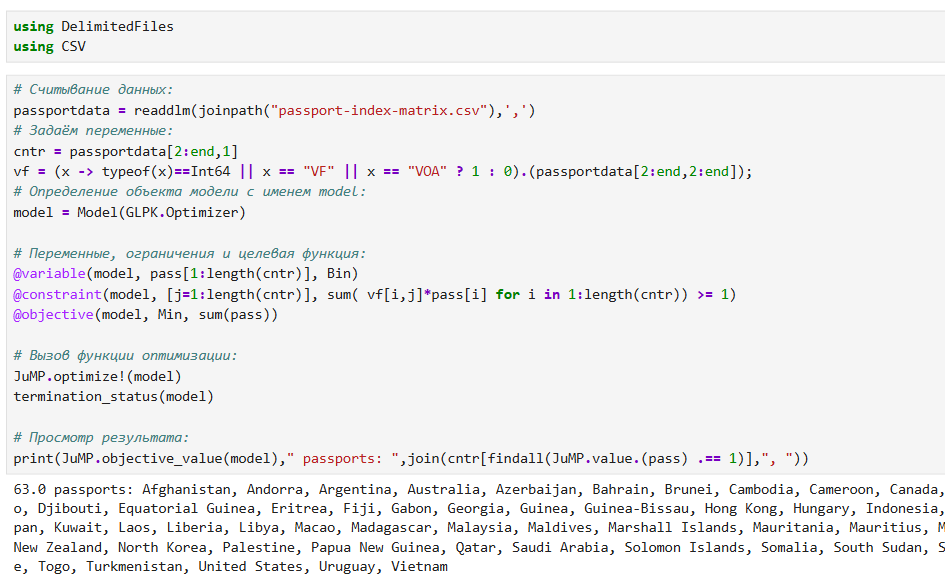
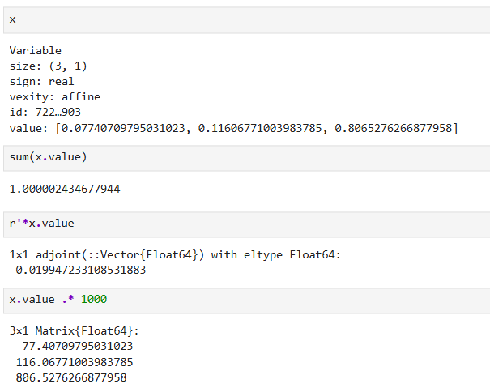
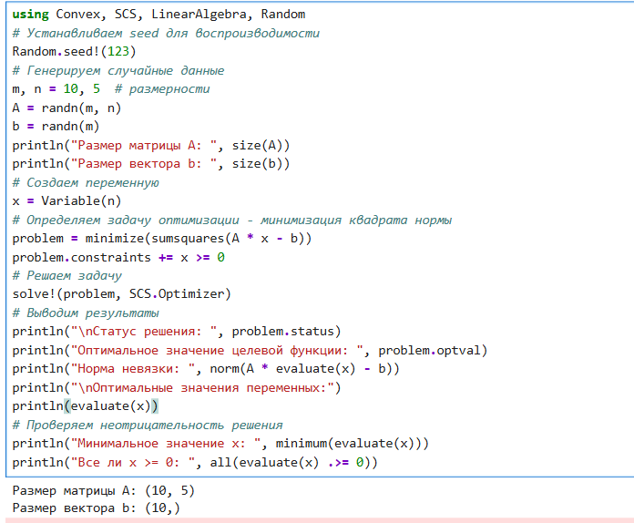
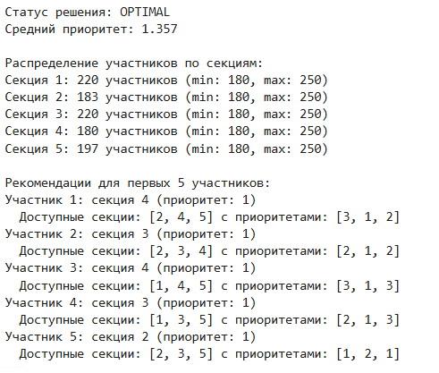

---
## Front matter
lang: ru-RU
title: "Оптимизация"
subtitle: "Лабораторная работа № 8"
author:
  - Шулуужук А. В.
institute:
  - Российский университет дружбы народов, Москва, Россия
date: 26 ноябрь 2025

## i18n babel
babel-lang: russian
babel-otherlangs: english

## Formatting pdf
toc: false
toc-title: Содержание
slide_level: 2
aspectratio: 169
section-titles: true
theme: metropolis
header-includes:
 - \metroset{progressbar=frametitle,sectionpage=progressbar,numbering=fraction}
 - '\makeatletter'
 - '\beamer@ignorenonframefalse'
 - '\makeatother'
---

## Цели и задачи

Основная цель работа — освоить пакеты Julia для решения задач оптимизации.

# Выполнение лабораторной работы

## Линейное программирование

{#fig:001 width=40%}

## Векторизованные ограничения и целевая функция оптимизации

{#fig:002 width=40%}

## Оптимизация рациона питания

{#fig:003 width=40%}

## Оптимизация рациона питания

{#fig:004 width=40%}

## Путешествие по миру

{#fig:005 width=70%}

## Портфельные инвестиции

{#fig:006 width=40%}

## Портфельные инвестиции

{#fig:007 width=40%}

## Восстановление изображения

{#fig:008 width=40%}

## Восстановление изображения

{#fig:009 width=40%}

# Самостоятельная работа

## Линейное программирование

{#fig:010 width=40%}

## Линейное программирование. Использование массивов

{#fig:011 width=40%}

## Выпуклое программирование

{#fig:012 width=40%}

## Выпуклое программирование

{#fig:013 width=40%}

## Оптимальная рассадка по залам

{#fig:014 width=50%}

## План приготовления кофе

{#fig:015 width=60%}

# Выводы

В результате выполнения лабораторной работы были освоены специализированные пакеты для решения задач оптимизации
