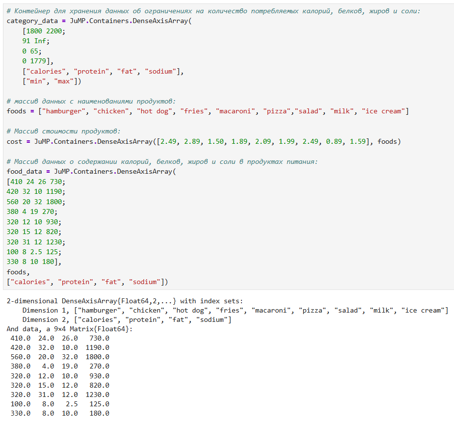
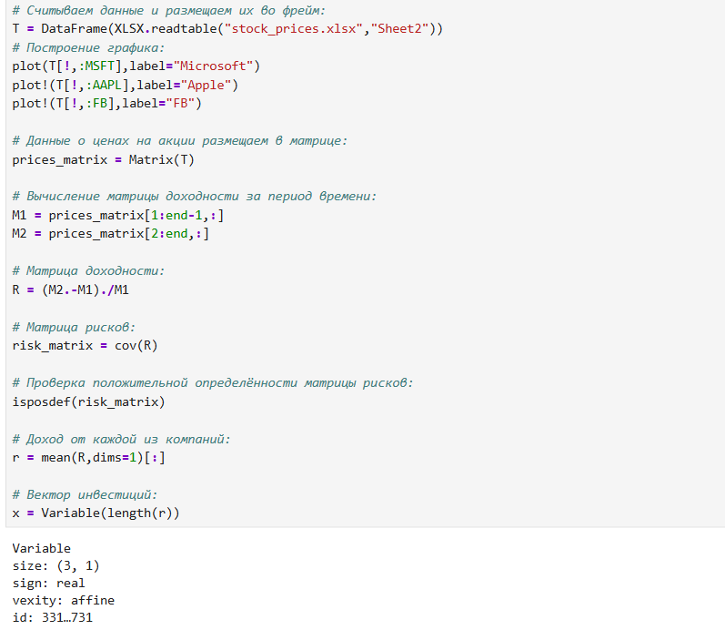
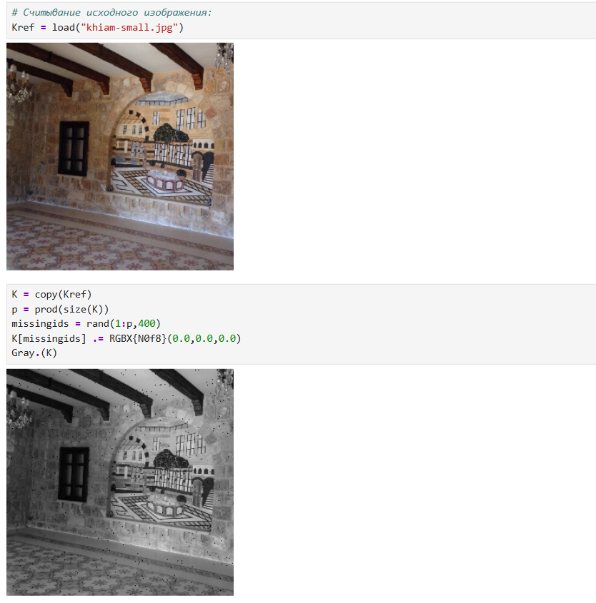
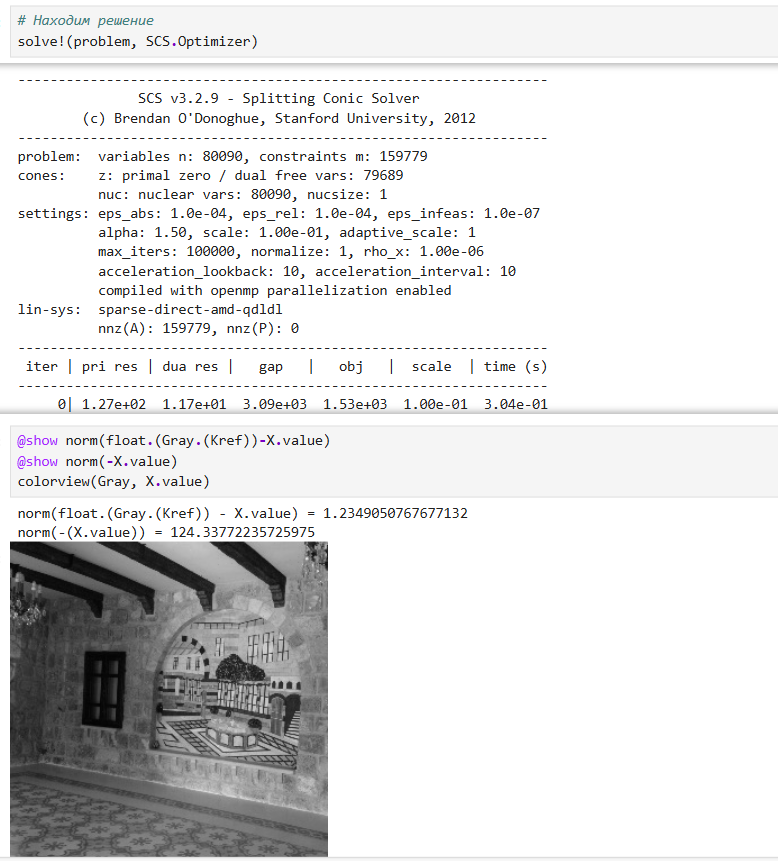
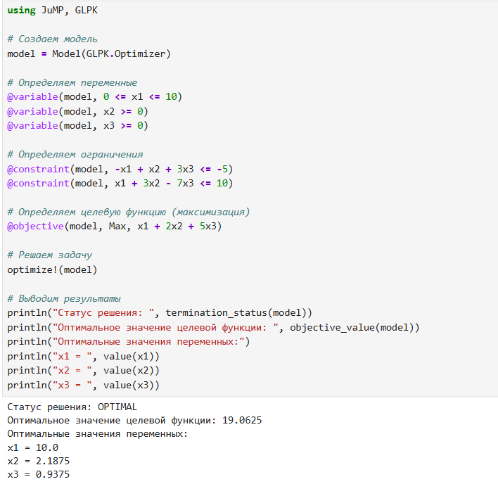
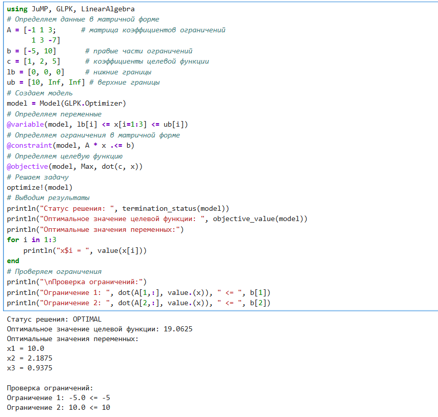
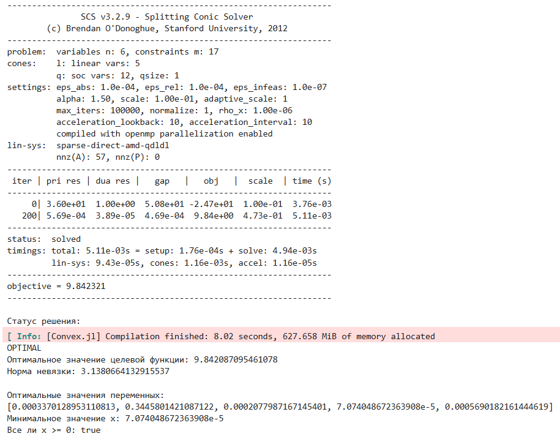
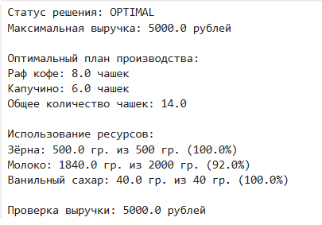

---
## Front matter
title: "Оптимизация"
subtitle: "Лабораторная работа № 8"
author: "Шулуужук Айраана НПИбд-01-22"

## Generic otions
lang: ru-RU
toc-title: "Содержание"

## Bibliography
bibliography: bib/cite.bib
csl: pandoc/csl/gost-r-7-0-5-2008-numeric.csl

## Pdf output format
toc: true # Table of contents
toc-depth: 2
lof: true # List of figures
lot: true # List of tables
fontsize: 12pt
linestretch: 1.5
papersize: a4
documentclass: scrreprt
## I18n polyglossia
polyglossia-lang:
  name: russian
  options:
	- spelling=modern
	- babelshorthands=true
polyglossia-otherlangs:
  name: english
## I18n babel
babel-lang: russian
babel-otherlangs: english
## Fonts
mainfont: IBM Plex Serif
romanfont: IBM Plex Serif
sansfont: IBM Plex Sans
monofont: IBM Plex Mono
mathfont: STIX Two Math
mainfontoptions: Ligatures=Common,Ligatures=TeX,Scale=0.94
romanfontoptions: Ligatures=Common,Ligatures=TeX,Scale=0.94
sansfontoptions: Ligatures=Common,Ligatures=TeX,Scale=MatchLowercase,Scale=0.94
monofontoptions: Scale=MatchLowercase,Scale=0.94,FakeStretch=0.9
mathfontoptions:
## Biblatex
biblatex: true
biblio-style: "gost-numeric"
biblatexoptions:
  - parentracker=true
  - backend=biber
  - hyperref=auto
  - language=auto
  - autolang=other*
  - citestyle=gost-numeric
## Pandoc-crossref LaTeX customization
figureTitle: "Рис."
tableTitle: "Таблица"
listingTitle: "Листинг"
lofTitle: "Список иллюстраций"
lotTitle: "Список таблиц"
lolTitle: "Листинги"
## Misc options
indent: true
header-includes:
  - \usepackage{indentfirst}
  - \usepackage{float} # keep figures where there are in the text
  - \floatplacement{figure}{H} # keep figures where there are in the text
---

# Цель работы

Основная цель работа — освоить пакеты Julia для решения задач оптимизации.

# Выполнение лабораторной работы

## Линейное программирование

Линейное программирование рассматривает решения экстремальных задач на множествах 𝑛-мерного векторного пространства, задаваемых системами линейных уравненийи неравенств.
Общей (стандартной) задачей линейного программирования называется задача на-
хождения минимума линейной целевой функции. Основной задачей линейного программирования называется задача, в которой есть ограничения в форме неравенств. Задачи линейного программирования со смешанными ограничениями, такими как
равенства и неравенства, с наличием переменных, свободных от ограничений, могут быть
сведены к эквивалентным с тем же множеством решений путём замены переменных
и замены равенств на пару неравенств.
В Julia есть несколько средств, предназначенных для решения оптимизационных задач.
Одним из таких средств является JuMP (https://jump.dev/) — язык моделирования
и вспомогательные пакеты для формулирования и решения задач математической опти-
мизации в Julia.
JuMP включает пакет Convex.jl (https://jump.dev/Convex.jl/stable/), позволяю-
щий описать задачу оптимизации, используя естественный математический синтаксис,
и решать её с помощью одного из решателей (COSMO, ECOS, SCS, GLPK, MathOptInterface)

Воспользуемся JuMP и решателем линейного и смешанного целочисленного програм-
мирования GLPK. Объект модели (контейнер для переменных, ограничений, параметров решателя и т. д.)
в JuMP создаётся при помощи функции Model(), в которой в качестве аргумента указы-
вается оптимизатор (решатель). Переменные задаются с помощью конструкции @variable (имя объекта модели, имя
и привязка переменной, тип переменной). Здесь же задаются граничные условия на
переменные (если тип переменной не определён, он считается действительным). 
В качестве первого аргумента указан объект модели model, затем переменные 𝑥 и 𝑦,
связанные с этой моделью (причём указанные переменные не могут использоваться
в другой модели).
Ограничения модели задаются с помощью конструкции @constraint (имя объекта
модели, ограничение).
алее следует задать собственно целевую функцию с помощью конструкции
@objective (имя объекта модели, Min или Max, функция для оптимизации). 
Для решения задачи оптимизации необходимо вызывать функцию оптимизации.
Процесс решения мог быть прекращён по ряду причин. Во-первых, решатель мог
найти оптимальное решение или доказать, что проблема невозможна. Однако он также
мог столкнуться с численными трудностями или прерваться из-за таких настроек, как
ограничение по времени. Если возвращено значение OPTIMAL, найдено оптимальное
решение.
Наконец, можно посмотреть собственно результат решения оптимизационной задачи (рис. [-@fig:001])

{#fig:001 width=70%}

## Векторизованные ограничения и целевая функция оптимизации

Часто бывает полезно создавать коллекции переменных JuMP внутри более сложных
структур данных. Можно добавить ограничения и цель в JuMP, используя векторизован-
ную линейную алгебру. Воспользуемся JuMP и решателем линейного и смешанного целочисленного програм-
мирования GLPK. Определим объект модели. Зададим исходные значения матрицы A и векторов ⃗ b, ⃗ c. Далее зададим массив переменных для компонент вектора. Затем зададим ограничения в соответствии с условиями модели. Далее зададим целевую функцию. Посмотрим результат решения оптимизационной задачи (рис. [-@fig:002])

{#fig:002 width=70%}

## Оптимизация рациона питания

В некоторых задачах требуется использование массивов, в которых индексы не явля-
ются целыми диапазонами с отсчётом от единицы. Например, требуется использовать
переменную, индексируемую по названию продукта или местоположению. Тогда необ-
ходимо в качестве индекса использовать произвольный вектор. В Julia это можно
реализовать с помощью DenseAxisArrays.
Рассмотрим применение DenseAxisArrays на примере решения задачи оптимизации
рациона питании в заведении быстрого питания при условии, что задано ограничение
на количество потребляемых калорий (1800–2200), белков (⩾ 91), жиров (0–65) и соли
(0–1779), а также перечень определённых продуктов питания с указанием их стоимости
— гамбургер (2.49 ден.ед.), курица (2.89 ден.ед.), сосиска в тесте (1.50 ден.ед.), жареный
картофель (1.89 ден.ед.), макароны (2.09 ден.ед.), пицца (1.99 ден.ед.), салат (2.49 ден.ед.),
молочный коктейль (0.89 ден.ед.), мороженное (1.59 ден.ед.). Также известно содержание
калорий, белков, жиров и соли в указанных продуктах. (рис. [-@fig:003]) 

{#fig:003 width=70%}

В результате оптимальным по цене и пищевой ценности будет предложено купить
гамбургер, молочный коктейль и мороженное (рис. [-@fig:004])

{#fig:004 width=70%}

## Путешествие по миру

Рассмотрим решение задачи определения оптимального числа паспортов, требую-
щихся, чтобы объехать весь мир. При этом будем учитывать сведения о паспортах
и ограничениях, указанных на ресурсе https://www.passportindex.org/. В таб-
личной форме данные можно получить с ресурса https://github.com/ilyankou/
passport-index-dataset. Для решения задачи представляют интерес данные, ука-
занные в файле passport-index-matrix.csv, в котором в первым столбце (Passport)
указана страна отбытия (= от), в остальных столбцах указаны страны назначения (= до),
на пересечении строк и столбцов указаны условия по наличию или отсутствию визы или
другие ограничения (рис. [-@fig:005]) 

{#fig:005 width=70%}

## Портфельные инвестиции

Портфельные инвестиции — размещение капитала в ценные бумаги, формируемые
в виде портфеля ценных бумаг, с целью получения прибыли.
Инвестиционный портфель — процесс стратегического управления капиталом как
оптимизированной, единой системой инвестиционных ценностей.
Предположим требуется решить оптимизационную задачу в следующей формулировке.
Имеется капитал в 1000 ден. ед., который планируется инвестировать в три компании —
Microsoft, Facebook, Apple. При этом есть данные еженедельных значений цен на акции
этих компаний за определённый период времени. Необходимо определить доходность
акций каждой компании за рассматриваемый период времени, после чего инвестировать
в эти три компании так, чтобы получить возврат в размере не менее 2% от вложенной
суммы.
Для решения оптимизационной задачи будем использовать пакет Convex.jl и опти-
мизатор (решатель) SCS. Кроме того, понадобится пакет Statistics.jl для получения
матрицы рисков на основе расчёта ковариационных значений по доходности. Сначала требуется подгрузить имеющиеся данные о еженедельных значениях цен
на акции рассматриваемых компаний, отобразить данные на графике. Предположим
данные размещены в файле stock_prices.xlsx в каталоге data в проекте (рис. [-@fig:005])

{#fig:006 width=70%}

Переводим процентные значения компонент вектора инвестиций в фактические де-
нежные единицы и получаем результат (рис. [-@fig:007])

{#fig:007 width=70%}

## Восстановление изображения

Предположим есть изображение, на котором были изменены некоторые пиксели. Тре-
буется восстановить неизвестные пиксели путём решения задачи оптимизации.
Будем использовать пакет Convex.jl и оптимизатор (решатель) SCS, пакет
ImageMagick.jl для работы с изображениями (рис. [-@fig:008])

{#fig:008 width=70%}

алее необходимо сформировать новую матрицу 𝑋, в которой минимизируется норма
ядра матрицы (т.е. сумма сингулярных чисел элементов матрицы) так, что элементы,
которые уже известны в матрице 𝑌, остаются теми же самыми в матрице 𝑋 (рис. [-@fig:009]) 

{#fig:009 width=70%}

# Самостоятельная работа

## Линейное программирование

Решим задачу линейного программирования при заданных ограничениях (рис. [-@fig:010])

{#fig:010 width=70%}

## Линейное программирование. Использование массивов

Решим предыдущее задание, используя массивы вместо скалярных переменных. Рекомендация. Запишите систему ограничений в виде A ⃗x = ⃗ b, а целевую функци как ⃗ cT ⃗ x (рис. [-@fig:011])

{#fig:011 width=70%}

## Выпуклое программирование

Решим задачу оптимизации при заданных ограничениях (рис. [-@fig:012]) 

{#fig:012 width=70%}

Матрицу A и вектор ⃗ b задайте случайным образом.
Для решения задачи используйте пакет Convex и решатель SCS (рис. [-@fig:013]) 

{#fig:013 width=70%}

## Оптимальная рассадка по залам

Проводится конференция с 5 разными секциями. Забронировано 5 залов различной
вместимости: в каждом зале не должно быть меньше 180 и больше 250 человек, а на
третьей секции активность подразумевает, что должно быть точно 220 человек.
В заявке участник указывает приоритет посещения секции: 1 — максимальный при-
оритет, 3 — минимальный, а значение 10000 означает, что человек не пойдёт на эту
секцию.
Организаторам удалось собрать 1000 заявок с указанием приоритета посещения трёх
секций. Необходимо дать рекомендацию слушателю, на какую же секцию ему пойти,
чтобы хватило места всем.
Для решения задачи используйте пакет Convex и решатель GLPK.
Приоритеты по слушателям распределите случайным образом (рис. [-@fig:014]) 

{#fig:014 width=70%}

## План приготовления кофе

Кофейня готовит два вида кофе «Раф кофе» за 400 рублей и «Капучино» за 300. Чтобы
сварить 1 чашку «Раф кофе» необходимо: 40 гр. зёрен, 140 гр. молока и 5 гр. ванильного
сахара. Для того чтобы получить одну чашку «Капучино» необходимо потратить: 30 гр.
зёрен, 120 гр. молока. На складе есть: 500 гр. зёрен, 2000 гр. молока и 40 гр. ванильного
сахара. Необходимо найти план варки кофе, обеспечивающий максимальную выручку от их
реализации. При этом необходимо потратить весь ванильный сахар.
Для решения задачи используйте пакет JuMP и решатель GLPK (рис. [-@fig:015]) 

{#fig:015 width=70%}

# Выводы

В результате выполнения лабораторной работы были освоены специализированные пакеты для решения задач оптимизации
